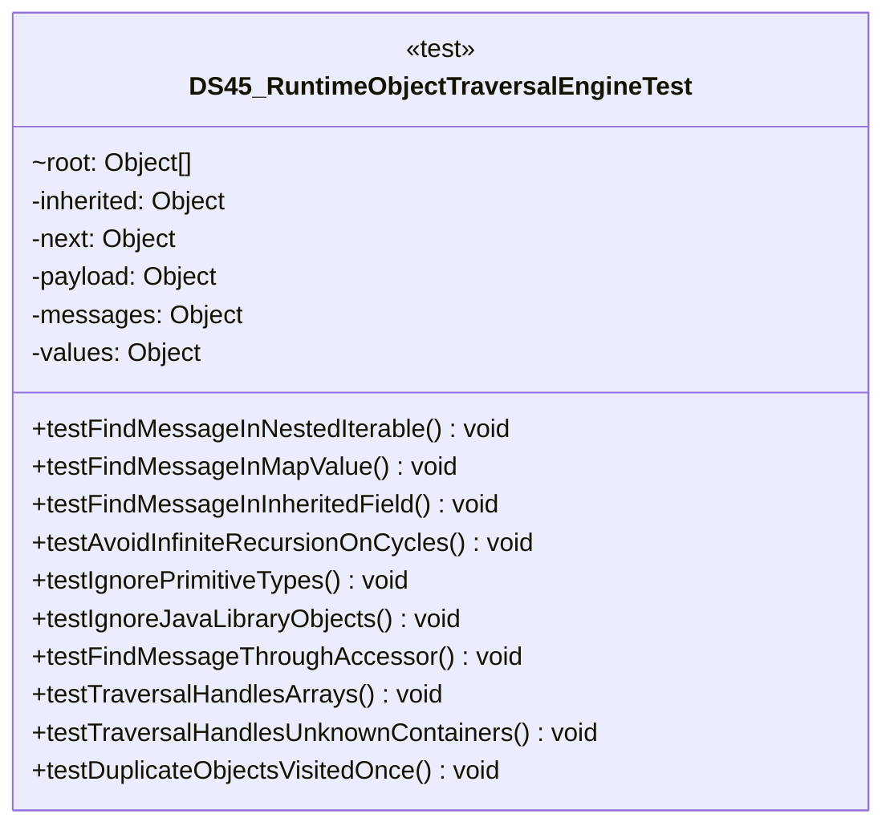

# DS45_RuntimeObjectTraversalEngineTest.java

## Path
test/Mock_hackathon/DataStructures/DS45_RuntimeObjectTraversalEngineTest.java

## Explanation

This test file defines the DS45_RuntimeObjectTraversalEngineTest class in the hackathon package. It belongs to test/Mock_hackathon/DataStructures in the COMP2100 MiniLab codebase and verifies behavior of the ds45 runtime object traversal engine implementation. It uses JUnit 4 style testing through org.junit imports. Key methods include testFindMessageInNestedIterable, testFindMessageInMapValue, testFindMessageInInheritedField, testAvoidInfiniteRecursionOnCycles, testIgnorePrimitiveTypes.

## Complexity

Test complexity depends on the tested scenario and input size; most unit tests use small fixed-size inputs.

## UML



## Code
```java
package hackathon;

import dao.model.Message;
import java.util.Arrays;
import java.util.Collections;
import java.util.HashMap;
import java.util.Iterator;
import java.util.List;
import java.util.Map;
import java.util.UUID;
import org.junit.Test;
import static org.junit.Assert.*;

/**
 * Tests DS45: Runtime object graph traversal engine.
 */
public class DS45_RuntimeObjectTraversalEngineTest {
    // Verifies messages can be found inside nested iterable containers.
    @Test
    public void testFindMessageInNestedIterable() {
        DS45_RuntimeObjectTraversalEngine engine = new DS45_RuntimeObjectTraversalEngine();
        Message target = message("nested iterable");
        Object root = Arrays.asList("ignored", Arrays.asList(Arrays.asList(target)));
        assertEquals(Collections.singletonList(target), engine.findMessages(root));
    }

    // Verifies map values are traversed when objects are keyed by UUID.
    @Test
    public void testFindMessageInMapValue() {
        DS45_RuntimeObjectTraversalEngine engine = new DS45_RuntimeObjectTraversalEngine();
        Message target = message("map value");
        Map<UUID, Object> root = new HashMap<>();
        root.put(target.id(), target);
        assertEquals(Collections.singletonList(target), engine.findMessages(root));
    }

    // Verifies inherited fields are searched through the class hierarchy.
    @Test
    public void testFindMessageInInheritedField() {
        DS45_RuntimeObjectTraversalEngine engine = new DS45_RuntimeObjectTraversalEngine();
        Message target = message("inherited field");
        ChildHolder root = new ChildHolder(target);
        assertEquals(Collections.singletonList(target), engine.findMessages(root));
    }

    // Verifies object cycles do not create infinite recursion.
    @Test
    public void testAvoidInfiniteRecursionOnCycles() {
        DS45_RuntimeObjectTraversalEngine engine = new DS45_RuntimeObjectTraversalEngine();
        Message target = message("cycle");
        Node first = new Node();
        Node second = new Node();
        first.next = second;
        second.next = first;
        second.payload = target;
        engine.addRoot(first);
        assertSame(target, engine.findMessage(target.id()));
    }

    // Verifies primitive and boxed scalar roots are ignored.
    @Test
    public void testIgnorePrimitiveTypes() {
        DS45_RuntimeObjectTraversalEngine engine = new DS45_RuntimeObjectTraversalEngine();
        assertTrue(engine.findMessages(42).isEmpty());
        assertFalse(engine.shouldInspectObject(int.class));
    }

    // Verifies Java library objects are not inspected through reflection.
    @Test
    public void testIgnoreJavaLibraryObjects() {
        DS45_RuntimeObjectTraversalEngine engine = new DS45_RuntimeObjectTraversalEngine();
        assertTrue(engine.findMessages(UUID.randomUUID()).isEmpty());
        assertFalse(engine.shouldInspectObject(String.class));
    }

    // Verifies common no-argument accessors can expose nested messages.
    @Test
    public void testFindMessageThroughAccessor() {
        DS45_RuntimeObjectTraversalEngine engine = new DS45_RuntimeObjectTraversalEngine();
        Message target = message("accessor");
        AccessorHolder root = new AccessorHolder(Collections.singletonList(target));
        assertEquals(Collections.singletonList(target), engine.findMessages(root));
    }

    // Verifies arrays are handled with the shared traversal path.
    @Test
    public void testTraversalHandlesArrays() {
        DS45_RuntimeObjectTraversalEngine engine = new DS45_RuntimeObjectTraversalEngine();
        Message target = message("array");
        Object[] root = new Object[] { "ignored", new Object[] { target } };
        assertEquals(Collections.singletonList(target), engine.traverse(root));
    }

    // Verifies unknown project containers can still be searched through fields.
    @Test
    public void testTraversalHandlesUnknownContainers() {
        DS45_RuntimeObjectTraversalEngine engine = new DS45_RuntimeObjectTraversalEngine();
        Message target = message("unknown container");
        UnknownContainer root = new UnknownContainer(new Object[] { target });
        assertEquals(Collections.singletonList(target), engine.findMessages(root));
    }

    // Verifies duplicate object references are reported once.
    @Test
    public void testDuplicateObjectsVisitedOnce() {
        DS45_RuntimeObjectTraversalEngine engine = new DS45_RuntimeObjectTraversalEngine();
        Message target = message("duplicate");
        Object root = Arrays.asList(target, target, Collections.singletonMap("message", target));
        List<Message> result = engine.findMessages(root);
        assertEquals(1, result.size());
        assertSame(target, result.get(0));
    }

    // Creates a MiniLab Message record for traversal tests.
    private Message message(String text) {
        return new Message(UUID.randomUUID(), UUID.randomUUID(), UUID.randomUUID(), System.currentTimeMillis(), text);
    }

    private static class ParentHolder {
        private final Object inherited;

        // Stores a value on the parent class for inherited-field traversal.
        ParentHolder(Object inherited) {
            this.inherited = inherited;
        }
    }

    private static class ChildHolder extends ParentHolder {
        // Creates a child holder that inherits storage from its parent.
        ChildHolder(Object inherited) {
            super(inherited);
        }
    }

    private static class Node {
        private Object next;
        private Object payload;
    }

    private static class AccessorHolder {
        private final Object messages;

        // Stores values behind a project-style accessor.
        AccessorHolder(Object messages) {
            this.messages = messages;
        }

        // Returns nested messages through a no-argument accessor.
        public Object getMessages() {
            return messages;
        }
    }

    private static class UnknownContainer {
        private final Object values;

        // Stores values in a shape unknown to the traversal engine.
        UnknownContainer(Object values) {
            this.values = values;
        }

        // Returns an iterator so tests can model DAO-style containers.
        public Iterator<?> iterator() {
            return Arrays.asList(values).iterator();
        }
    }
}

```
