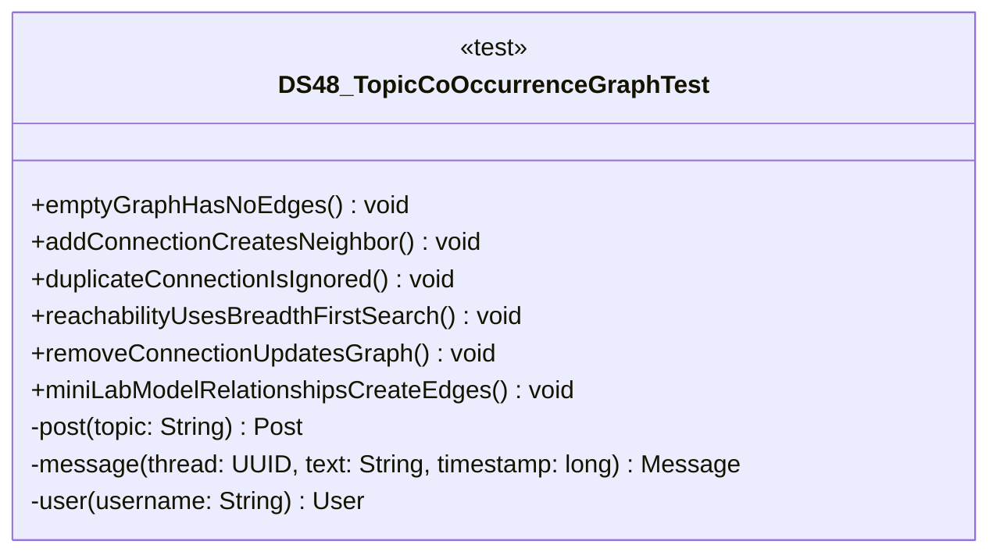

# DS48_TopicCoOccurrenceGraphTest.java

## Path
test/Mock_hackathon/DataStructures/DS48_TopicCoOccurrenceGraphTest.java

## Explanation

This test file defines the DS48_TopicCoOccurrenceGraphTest class in the hackathon package. It belongs to test/Mock_hackathon/DataStructures in the COMP2100 MiniLab codebase and verifies behavior of the ds48 topic co occurrence graph implementation. It uses JUnit 4 style testing through org.junit imports. Key methods include emptyGraphHasNoEdges, addConnectionCreatesNeighbor, duplicateConnectionIsIgnored, reachabilityUsesBreadthFirstSearch, removeConnectionUpdatesGraph.

## Complexity

Test complexity depends on the tested scenario and input size; most unit tests use small fixed-size inputs.

## UML



## Code
```java
package hackathon;

import dao.model.Message;
import dao.model.Post;
import dao.model.User;
import java.util.UUID;
import org.junit.Test;
import static org.junit.Assert.*;

/**
 * Tests DS48: Topic co-occurrence graph.
 */
public class DS48_TopicCoOccurrenceGraphTest {
    // Verifies that a new graph has no nodes or edges.
    @Test
    public void emptyGraphHasNoEdges() {
        DS48_TopicCoOccurrenceGraph graph = new DS48_TopicCoOccurrenceGraph();
        assertEquals(0, graph.nodeCount());
        assertEquals(0, graph.edgeCount());
    }

    // Verifies that adding a connection records both endpoints.
    @Test
    public void addConnectionCreatesNeighbor() {
        DS48_TopicCoOccurrenceGraph graph = new DS48_TopicCoOccurrenceGraph();
        UUID a = UUID.randomUUID();
        UUID b = UUID.randomUUID();
        graph.addConnection(a, b);
        assertTrue(graph.neighbors(a).contains(b));
        assertEquals(2, graph.nodeCount());
    }

    // Verifies that duplicate connections count once.
    @Test
    public void duplicateConnectionIsIgnored() {
        DS48_TopicCoOccurrenceGraph graph = new DS48_TopicCoOccurrenceGraph();
        UUID a = UUID.randomUUID();
        UUID b = UUID.randomUUID();
        graph.addConnection(a, b);
        graph.addConnection(a, b);
        assertEquals(1, graph.edgeCount());
    }

    // Verifies reachability across multiple hops.
    @Test
    public void reachabilityUsesBreadthFirstSearch() {
        DS48_TopicCoOccurrenceGraph graph = new DS48_TopicCoOccurrenceGraph();
        UUID a = UUID.randomUUID();
        UUID b = UUID.randomUUID();
        UUID cNode = UUID.randomUUID();
        graph.addConnection(a, b);
        graph.addConnection(b, cNode);
        assertTrue(graph.isReachable(a, cNode));
        assertEquals(2, graph.shortestDistance(a, cNode));
    }

    // Verifies that removing a connection breaks reachability.
    @Test
    public void removeConnectionUpdatesGraph() {
        DS48_TopicCoOccurrenceGraph graph = new DS48_TopicCoOccurrenceGraph();
        UUID a = UUID.randomUUID();
        UUID b = UUID.randomUUID();
        graph.addConnection(a, b);
        assertTrue(graph.removeConnection(a, b));
        assertFalse(graph.isReachable(a, b));
    }
    // Verifies MiniLab model relationships create graph edges.
    @Test
    public void miniLabModelRelationshipsCreateEdges() {
        DS48_TopicCoOccurrenceGraph graph = new DS48_TopicCoOccurrenceGraph();
        Post first = post("first");
        Post second = post("second");
        User viewer = user("viewer");
        User author = user("author");
        Message reply = message(first.id, "reply", 5L);
        graph.addPostRelationship(first, second);
        graph.addUserRelationship(viewer, author);
        graph.addThreadMessage(reply);
        assertTrue(graph.neighbors(first.id).contains(second.id));
        assertTrue(graph.neighbors(viewer.id()).contains(author.id()));
        assertTrue(graph.neighbors(first.id).contains(reply.id()));
    }

    // Creates a MiniLab Post for integration tests.
    private Post post(String topic) {
        return new Post(UUID.randomUUID(), UUID.randomUUID(), topic);
    }

    // Creates a MiniLab Message for integration tests.
    private Message message(UUID thread, String text, long timestamp) {
        return new Message(UUID.randomUUID(), UUID.randomUUID(), thread, timestamp, text);
    }

    // Creates a MiniLab User for integration tests.
    private User user(String username) {
        return new User(UUID.randomUUID(), User.Role.Member, username, "password");
    }


}

```
