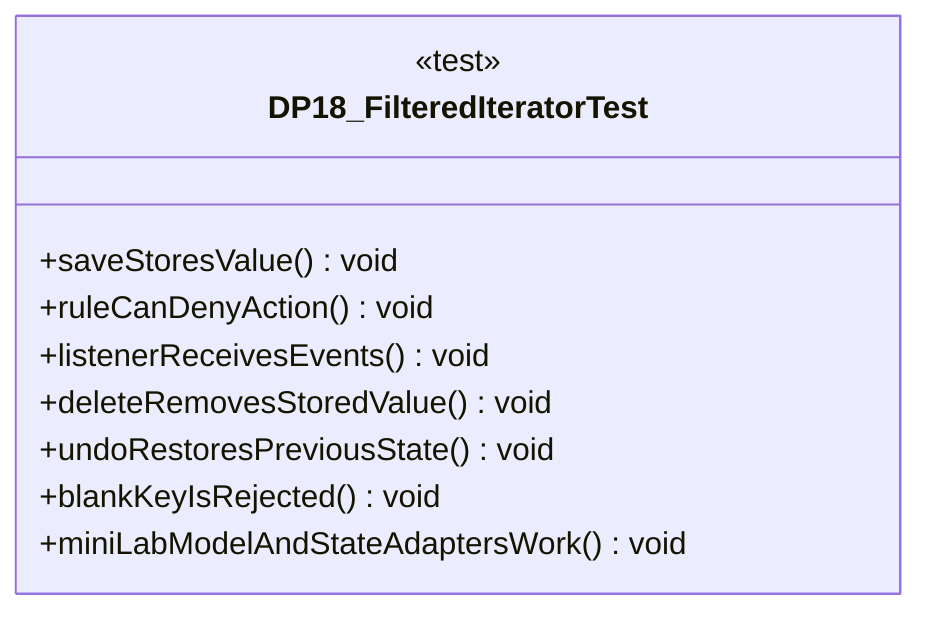

# DP18_FilteredIteratorTest.java

## Path
test/Mock_hackathon/DesignPatterns/DP18_FilteredIteratorTest.java

## Explanation

This test file defines the DP18_FilteredIteratorTest class in the hackathon package. It belongs to test/Mock_hackathon/DesignPatterns in the COMP2100 MiniLab codebase and verifies behavior of the dp18 filtered iterator implementation. It uses JUnit 4 style testing through org.junit imports. Key methods include saveStoresValue, ruleCanDenyAction, listenerReceivesEvents, deleteRemovesStoredValue, undoRestoresPreviousState.

## Complexity

Test complexity depends on the tested scenario and input size; most unit tests use small fixed-size inputs.

## UML



## Code
```java
package hackathon;

import dao.model.User;
import java.util.ArrayList;
import java.util.Collections;
import java.util.List;
import java.util.UUID;
import org.junit.Test;
import userstate.GuestState;
import static org.junit.Assert.*;

/**
 * Tests DP18: Filtered iterator.
 */
public class DP18_FilteredIteratorTest {
    // Verifies that saving stores values by key.
    @Test
    public void saveStoresValue() {
        DP18_FilteredIterator service = new DP18_FilteredIterator();
        assertTrue(service.save("member", "post-1", "hello"));
        assertEquals("hello", service.find("post-1").get());
    }

    // Verifies that strategy rules can deny work.
    @Test
    public void ruleCanDenyAction() {
        DP18_FilteredIterator service = new DP18_FilteredIterator();
        service.setRule((role, action) -> false);
        assertFalse(service.save("guest", "post-1", "hello"));
        assertFalse(service.find("post-1").isPresent());
    }

    // Verifies that listeners observe service events.
    @Test
    public void listenerReceivesEvents() {
        DP18_FilteredIterator service = new DP18_FilteredIterator();
        List<String> events = new ArrayList<>();
        service.addListener(events::add);
        service.save("member", "post-1", "hello");
        assertEquals(Collections.singletonList("saved:post-1"), events);
    }

    // Verifies that delete respects existing data.
    @Test
    public void deleteRemovesStoredValue() {
        DP18_FilteredIterator service = new DP18_FilteredIterator();
        service.save("member", "post-1", "hello");
        assertTrue(service.delete("admin", "post-1"));
        assertEquals(0, service.size());
    }

    // Verifies that undo restores the previous state.
    @Test
    public void undoRestoresPreviousState() {
        DP18_FilteredIterator service = new DP18_FilteredIterator();
        service.save("member", "post-1", "hello");
        assertTrue(service.undoLast());
        assertFalse(service.find("post-1").isPresent());
    }

    // Verifies that blank keys are rejected.
    @Test(expected = IllegalArgumentException.class)
    public void blankKeyIsRejected() {
        DP18_FilteredIterator service = new DP18_FilteredIterator();
        service.save("member", " ", "value");
    }
    // Verifies the service integrates with MiniLab model and state abstractions.
    @Test
    public void miniLabModelAndStateAdaptersWork() {
        DP18_FilteredIterator service = new DP18_FilteredIterator();
        User user = new User(UUID.randomUUID(), User.Role.Member, "patternuser", "password");
        assertTrue(service.saveUser(user));
        assertEquals("patternuser", service.find(user.id().toString()).get());
        assertFalse(service.isStateLoggedIn(new GuestState()));
        assertNotNull(service.sortedKeys());
        assertNotNull(service.dataManager());
        assertEquals("clean", service.censorWith(text -> "clean", "raw"));
    }


}

```
