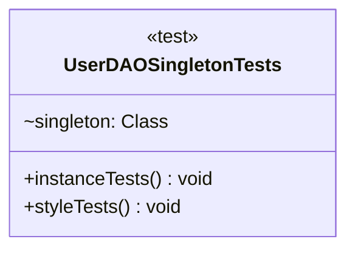

# UserDAOSingletonTests.java

## Path
test/UserDAOSingletonTests.java

## Explanation

This test file defines the UserDAOSingletonTests class. It belongs to test in the COMP2100 MiniLab codebase and verifies behavior of the user dao singleton implementation. It uses JUnit 4 style testing through org.junit imports. Key methods include instanceTests, styleTests.

## Complexity

Test complexity depends on the tested scenario and input size; most unit tests use small fixed-size inputs.

## UML



## Code
```java
import dao.UserDAO;
import junit.framework.TestCase;
import org.junit.Test;
import org.junit.runner.RunWith;
import org.junit.runners.JUnit4;

import java.lang.reflect.Constructor;
import java.lang.reflect.Modifier;

import static junit.framework.TestCase.assertEquals;
import static org.junit.Assert.assertNotNull;

@RunWith(JUnit4.class)
public class UserDAOSingletonTests {
	@Test(timeout=1000)
	public void instanceTests() {
		UserDAO first = UserDAO.getInstance();
		assertNotNull("getInstance must not return null", first);
		for (int i = 0; i < 100; i++) {
			UserDAO other = UserDAO.getInstance();
			assertEquals("Each call to getInstance must return the same object", first, other);
		}
	}

	@Test(timeout=1000)
	public void styleTests() {
		Class<?> singleton = UserDAO.class;
		for (Constructor<?> constructor : singleton.getDeclaredConstructors()) {
			if (Modifier.isPrivate(constructor.getModifiers())) continue;
			TestCase.fail("""
					Your singleton has a (possibly default) public constructor.
					This is highly problematic... ask your tutor if you're not sure why.""");
		}
	}
}

```
