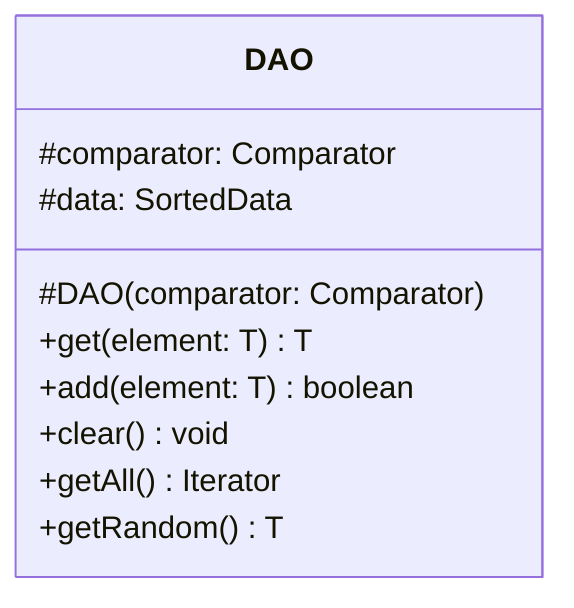

# DAO.java

## Explanation

This file defines the DAO class in the dao package. It belongs to src/dao in the COMP2100 MiniLab codebase and separates data access responsibilities from application logic. Key methods include get, add, clear, getAll, getRandom.

## Complexity

DAO operation complexity depends on the backing storage. In-memory lookups may be O(1) with maps or O(n) with lists; file-backed operations may require O(n) scanning or serialization.

## UML



## Code
```java
package dao;

import dao.model.HasUUID;
import sorteddata.SortedData;
import sorteddata.SortedDataFactory;
import java.util.Comparator;
import java.util.Iterator;

public abstract class DAO<T extends HasUUID> {
	protected DAO(Comparator<T> comparator) {
		this.comparator = comparator;
		clear();
	}

	protected final Comparator<T> comparator;

	protected SortedData<T> data;

	/**
	 * Fetches an element from the DAO by comparison with the stored comparator.
	 * In particular, if the comparator only checks equality of some members of
	 * the generic class T, this method finds the element stored that matches
	 * in those fields.
	 * @param element the element to find
	 * @return the element if found, null otherwise
	 */
	public T get(T element) {
		return data.get(element);
	}

	/**
	 * Adds a particular element to the DAO
	 * @param element the element
	 * @return true if the operation was successful, false otherwise
	 */
	public boolean add(T element) {
		return data.insert(element);
	}

	/**
	 * Resets the DAO into its initial state, where it stores no elements
	 */
	public void clear() {
		data = SortedDataFactory.makeSortedData(comparator);
	}

	/**
	 * Fetches every element from the DAO in order
	 * @return the element
	 */
	public Iterator<T> getAll() {
		return data.getAll();
	}

	/**
	 * Fetches a single random element from the DAO
	 * @return the element
	 */
	public T getRandom() {
		return data.getRandom();
	}
}

```
