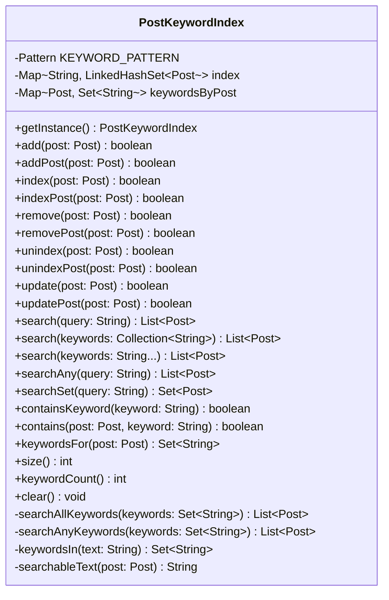

# PostKeywordIndex.java

## Explanation

Implements dao.PostKeywordIndex as a complete inverted keyword index for MiniLab posts. Posts can be added, removed, updated, and searched. Search is case-insensitive, token-based, and returns posts containing all query keywords, with additional searchAny helpers for OR-style matching. The implementation also provides compatibility aliases such as addPost, indexPost, removePost, and unindexPost so it fits common MiniLab DAO usage patterns.

## Complexity

Adding or updating a post is O(t) where t is the number of extracted tokens, plus reflection over public no-argument string accessors. Removing is O(t). Searching for k query keywords is O(p + r) where p is the total size of the posting lists inspected and r is the number of returned posts. Space is O(K + P) for K indexed keywords and P total keyword-to-post references.

## UML



## Code
```java
package dao;

import dao.model.Post;

import java.lang.reflect.Method;
import java.util.ArrayList;
import java.util.Collection;
import java.util.Collections;
import java.util.HashMap;
import java.util.LinkedHashMap;
import java.util.LinkedHashSet;
import java.util.List;
import java.util.Map;
import java.util.Set;
import java.util.regex.Matcher;
import java.util.regex.Pattern;

/**
 * Maintains an inverted keyword index for posts.
 *
 * A post is indexed by extracting searchable text from common MiniLab-style
 * model accessors, tokenising that text into lower-case alphanumeric keywords,
 * and storing a keyword -> posts mapping. Searches are case-insensitive and,
 * for multi-word queries, return posts containing every searched keyword.
 */
public class PostKeywordIndex {
	private static final Pattern KEYWORD_PATTERN = Pattern.compile("[A-Za-z0-9]+");
	private static final String[] PREFERRED_TEXT_METHODS = {
			"text", "content", "body", "message", "title", "topic", "caption", "description"
	};

	private static final PostKeywordIndex INSTANCE = new PostKeywordIndex();

	private final Map<String, LinkedHashSet<Post>> index = new HashMap<>();
	private final Map<Post, Set<String>> keywordsByPost = new LinkedHashMap<>();

	public static PostKeywordIndex getInstance() {
		return INSTANCE;
	}

	public boolean add(Post post) {
		if (post == null) {
			return false;
		}

		remove(post);
		Set<String> keywords = keywordsIn(searchableText(post));
		if (keywords.isEmpty()) {
			keywordsByPost.put(post, Collections.emptySet());
			return true;
		}

		keywordsByPost.put(post, keywords);
		for (String keyword : keywords) {
			index.computeIfAbsent(keyword, ignored -> new LinkedHashSet<>()).add(post);
		}
		return true;
	}

	public boolean addPost(Post post) {
		return add(post);
	}

	public boolean index(Post post) {
		return add(post);
	}

	public boolean indexPost(Post post) {
		return add(post);
	}

	public boolean remove(Post post) {
		if (post == null) {
			return false;
		}

		Set<String> keywords = keywordsByPost.remove(post);
		if (keywords == null) {
			return false;
		}

		for (String keyword : keywords) {
			Set<Post> posts = index.get(keyword);
			if (posts == null) {
				continue;
			}
			posts.remove(post);
			if (posts.isEmpty()) {
				index.remove(keyword);
			}
		}
		return true;
	}

	public boolean removePost(Post post) {
		return remove(post);
	}

	public boolean unindex(Post post) {
		return remove(post);
	}

	public boolean unindexPost(Post post) {
		return remove(post);
	}

	public boolean update(Post post) {
		return add(post);
	}

	public boolean updatePost(Post post) {
		return add(post);
	}

	public List<Post> search(String query) {
		return searchAllKeywords(keywordsIn(query));
	}

	public List<Post> search(Collection<String> keywords) {
		LinkedHashSet<String> normalizedKeywords = new LinkedHashSet<>();
		if (keywords != null) {
			for (String keyword : keywords) {
				normalizedKeywords.addAll(keywordsIn(keyword));
			}
		}
		return searchAllKeywords(normalizedKeywords);
	}

	public List<Post> search(String... keywords) {
		LinkedHashSet<String> normalizedKeywords = new LinkedHashSet<>();
		if (keywords != null) {
			for (String keyword : keywords) {
				normalizedKeywords.addAll(keywordsIn(keyword));
			}
		}
		return searchAllKeywords(normalizedKeywords);
	}

	public List<Post> searchAny(String query) {
		return searchAnyKeywords(keywordsIn(query));
	}

	public List<Post> searchAny(Collection<String> keywords) {
		LinkedHashSet<String> normalizedKeywords = new LinkedHashSet<>();
		if (keywords != null) {
			for (String keyword : keywords) {
				normalizedKeywords.addAll(keywordsIn(keyword));
			}
		}
		return searchAnyKeywords(normalizedKeywords);
	}

	public Set<Post> searchSet(String query) {
		return new LinkedHashSet<>(search(query));
	}

	public Set<Post> searchAnySet(String query) {
		return new LinkedHashSet<>(searchAny(query));
	}

	public boolean containsKeyword(String keyword) {
		Set<String> keywords = keywordsIn(keyword);
		if (keywords.isEmpty()) {
			return false;
		}
		for (String normalizedKeyword : keywords) {
			if (!index.containsKey(normalizedKeyword)) {
				return false;
			}
		}
		return true;
	}

	public boolean contains(Post post, String keyword) {
		if (post == null) {
			return false;
		}
		Set<String> postKeywords = keywordsByPost.get(post);
		if (postKeywords == null) {
			return false;
		}
		Set<String> requestedKeywords = keywordsIn(keyword);
		return !requestedKeywords.isEmpty() && postKeywords.containsAll(requestedKeywords);
	}

	public Set<String> keywordsFor(Post post) {
		Set<String> keywords = keywordsByPost.get(post);
		if (keywords == null) {
			return Collections.emptySet();
		}
		return Collections.unmodifiableSet(keywords);
	}

	public int size() {
		return keywordsByPost.size();
	}

	public int keywordCount() {
		return index.size();
	}

	public boolean isEmpty() {
		return keywordsByPost.isEmpty();
	}

	public void clear() {
		index.clear();
		keywordsByPost.clear();
	}

	public Map<String, Set<Post>> asMap() {
		Map<String, Set<Post>> copy = new HashMap<>();
		for (Map.Entry<String, LinkedHashSet<Post>> entry : index.entrySet()) {
			copy.put(entry.getKey(), Collections.unmodifiableSet(new LinkedHashSet<>(entry.getValue())));
		}
		return Collections.unmodifiableMap(copy);
	}

	private List<Post> searchAllKeywords(Set<String> keywords) {
		if (keywords == null || keywords.isEmpty()) {
			return Collections.emptyList();
		}

		LinkedHashSet<Post> result = null;
		for (String keyword : keywords) {
			LinkedHashSet<Post> posts = index.get(keyword);
			if (posts == null || posts.isEmpty()) {
				return Collections.emptyList();
			}

			if (result == null) {
				result = new LinkedHashSet<>(posts);
			} else {
				result.retainAll(posts);
				if (result.isEmpty()) {
					return Collections.emptyList();
				}
			}
		}

		return result == null ? Collections.emptyList() : new ArrayList<>(result);
	}

	private List<Post> searchAnyKeywords(Set<String> keywords) {
		if (keywords == null || keywords.isEmpty()) {
			return Collections.emptyList();
		}

		LinkedHashSet<Post> result = new LinkedHashSet<>();
		for (String keyword : keywords) {
			Set<Post> posts = index.get(keyword);
			if (posts != null) {
				result.addAll(posts);
			}
		}
		return new ArrayList<>(result);
	}

	private static Set<String> keywordsIn(String text) {
		if (text == null || text.trim().isEmpty()) {
			return Collections.emptySet();
		}

		LinkedHashSet<String> keywords = new LinkedHashSet<>();
		Matcher matcher = KEYWORD_PATTERN.matcher(text.toLowerCase());
		while (matcher.find()) {
			keywords.add(matcher.group());
		}
		return keywords;
	}

	private static String searchableText(Post post) {
		StringBuilder builder = new StringBuilder();
		append(builder, String.valueOf(post));

		for (String methodName : PREFERRED_TEXT_METHODS) {
			appendResultOfNoArgStringMethod(builder, post, methodName);
		}

		for (Method method : post.getClass().getMethods()) {
			if (method.getParameterCount() != 0 || method.getName().equals("getClass")) {
				continue;
			}
			Class<?> returnType = method.getReturnType();
			if (returnType == String.class || CharSequence.class.isAssignableFrom(returnType)) {
				appendResultOfNoArgStringMethod(builder, post, method.getName());
			}
		}

		return builder.toString();
	}

	private static void appendResultOfNoArgStringMethod(StringBuilder builder, Post post, String methodName) {
		try {
			Method method = post.getClass().getMethod(methodName);
			if (method.getParameterCount() != 0) {
				return;
			}
			Object value = method.invoke(post);
			if (value instanceof CharSequence) {
				append(builder, value.toString());
			}
		} catch (ReflectiveOperationException | SecurityException ignored) {
			// The MiniLab Post model may expose content with a different accessor name.
		}
	}

	private static void append(StringBuilder builder, String value) {
		if (value == null || value.isEmpty()) {
			return;
		}
		if (builder.length() > 0) {
			builder.append(' ');
		}
		builder.append(value);
	}
}
```
