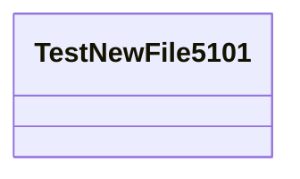

# TestNewFile5101.java

## Explanation

Temporary explorer validation file.

## Complexity

O(1).

## UML



## Code
```java
public class TestNewFile5101 {
  public String value() {
    return "ok";
  }
}

```
