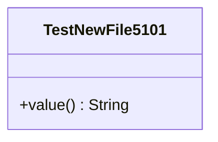

# TestNewFile5101Renamed.java

## Explanation

Edited temporary explorer validation file.

## Complexity

O(1).

## UML



## Code
```java
public class TestNewFile5101 {
  public String value() {
    return "edited";
  }
}

```
