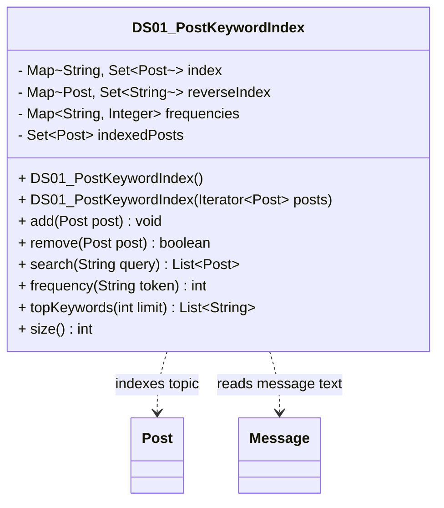

# DS01_PostKeywordIndex.java

## Explanation

DS01_PostKeywordIndex is a Mock_hackathon practice implementation for DS01: Post keyword inverted index. It is stored separately from the original MiniLab packages so it can be studied as an extension-style hackathon task without changing the base codebase.

The feature is: Search posts by words in topic/title/body without scanning every post. The task is: Build an index that maps each normalized token to the posts containing it.

This implementation imports dao.model.Post and dao.model.Message from the original MiniLab model layer so it can index real post topics and message bodies using the same public fields and record accessors used elsewhere in MiniLab.

The class stores a token-to-Post map, a reverse Post-to-token map, token frequencies, and a set of indexed posts. add(Post) reads post.topic and iterates post.messages.getAll() to collect Message text, search(String) intersects token buckets for multi-word queries, remove(Post) cleans every reverse mapping, and topKeywords(int) ranks indexed tokens by document frequency.

Important edge cases are handled directly in code and tests: empty input, duplicate data, missing records, replacement or removal behavior, and invalid keys where relevant. This makes the class suitable for a mini project hackathon because it demonstrates the core behavior clearly while remaining small enough to modify under time pressure.

A Test Case block is attached to this implementation topic with JUnit 4 coverage for the DS01 catalogue behavior.

## Complexity

Software Architecture and UML Description:

DS01_PostKeywordIndex sits beside the DAO layer as a search helper for MiniLab posts. It depends on dao.model.Post because it reads post.topic and on dao.model.Message because it iterates post.messages.getAll() and reads message.message().

In UML, draw dashed dependency arrows from the index to Post and Message because it uses those model objects but does not own their lifecycle. The internal maps and token buckets are owned by the index, so helper storage can be represented with composition if it is modeled explicitly. If PostDAO or another caller uses this index, draw a dashed dependency arrow from that caller to the index.

PlantUML guidance:
DS01_PostKeywordIndex ..> Post : reads topic
DS01_PostKeywordIndex ..> Message : reads message text
PostDAO ..> DS01_PostKeywordIndex : uses search helper

## UML



## Code
```java
package hackathon;

import dao.model.Message;
import dao.model.Post;
import java.util.ArrayList;
import java.util.Collections;
import java.util.HashMap;
import java.util.Iterator;
import java.util.LinkedHashSet;
import java.util.List;
import java.util.Locale;
import java.util.Map;
import java.util.Set;

/**
 * DS01 practice implementation for post keyword inverted index.
 */
public class DS01_PostKeywordIndex {
    private final Map<String, Set<Post>> index = new HashMap<>();
    private final Map<Post, Set<String>> reverseIndex = new HashMap<>();
    private final Map<String, Integer> frequencies = new HashMap<>();
    private final Set<Post> indexedPosts = new LinkedHashSet<>();

    // Creates an empty post keyword index.
    public DS01_PostKeywordIndex() {
    }

    // Adds all posts from an iterator to the index.
    public DS01_PostKeywordIndex(Iterator<Post> posts) {
        if (posts == null) {
            return;
        }
        while (posts.hasNext()) {
            add(posts.next());
        }
    }

    // Adds a post topic and message text to the keyword index.
    public void add(Post post) {
        if (post == null) {
            return;
        }
        remove(post);
        Set<String> tokens = tokenize(searchableText(post));
        reverseIndex.put(post, tokens);
        indexedPosts.add(post);
        for (String token : tokens) {
            index.computeIfAbsent(token, key -> new LinkedHashSet<>()).add(post);
            frequencies.put(token, frequency(token) + 1);
        }
    }

    // Removes a post from every keyword bucket.
    public boolean remove(Post post) {
        Set<String> tokens = reverseIndex.remove(post);
        if (tokens == null) {
            return false;
        }
        indexedPosts.remove(post);
        for (String token : tokens) {
            Set<Post> bucket = index.get(token);
            if (bucket != null) {
                bucket.remove(post);
                if (bucket.isEmpty()) {
                    index.remove(token);
                }
            }
            int next = frequencies.getOrDefault(token, 1) - 1;
            if (next <= 0) {
                frequencies.remove(token);
            } else {
                frequencies.put(token, next);
            }
        }
        return true;
    }

    // Searches for posts containing all valid tokens in the query.
    public List<Post> search(String query) {
        Set<String> tokens = tokenize(query);
        if (tokens.isEmpty()) {
            return Collections.emptyList();
        }
        Iterator<String> iterator = tokens.iterator();
        Set<Post> result = new LinkedHashSet<>(index.getOrDefault(iterator.next(), Collections.emptySet()));
        while (iterator.hasNext()) {
            result.retainAll(index.getOrDefault(iterator.next(), Collections.emptySet()));
        }
        return new ArrayList<>(result);
    }

    // Returns how many indexed posts contain a token.
    public int frequency(String token) {
        return frequencies.getOrDefault(normalize(token), 0);
    }

    // Returns keywords ordered by frequency then alphabetically.
    public List<String> topKeywords(int limit) {
        List<String> keywords = new ArrayList<>(frequencies.keySet());
        keywords.sort((left, right) -> {
            int byFrequency = Integer.compare(frequencies.get(right), frequencies.get(left));
            return byFrequency != 0 ? byFrequency : left.compareTo(right);
        });
        return keywords.subList(0, Math.min(Math.max(0, limit), keywords.size()));
    }

    // Returns the number of indexed posts.
    public int size() {
        return indexedPosts.size();
    }

    // Builds searchable text from Post.topic and all Message records.
    private String searchableText(Post post) {
        StringBuilder text = new StringBuilder();
        if (post.topic != null) {
            text.append(post.topic).append(' ');
        }
        Iterator<Message> messages = post.messages.getAll();
        while (messages.hasNext()) {
            Message message = messages.next();
            if (message.message() != null) {
                text.append(message.message()).append(' ');
            }
        }
        return text.toString();
    }

    // Converts text into normalized unique tokens.
    private Set<String> tokenize(String text) {
        Set<String> tokens = new LinkedHashSet<>();
        if (text == null) {
            return tokens;
        }
        for (String raw : text.split("[^A-Za-z0-9]+")) {
            String token = normalize(raw);
            if (!token.isEmpty()) {
                tokens.add(token);
            }
        }
        return tokens;
    }

    // Normalizes a token for case-insensitive lookup.
    private String normalize(String token) {
        return token == null ? "" : token.toLowerCase(Locale.ROOT).trim();
    }
}

```
