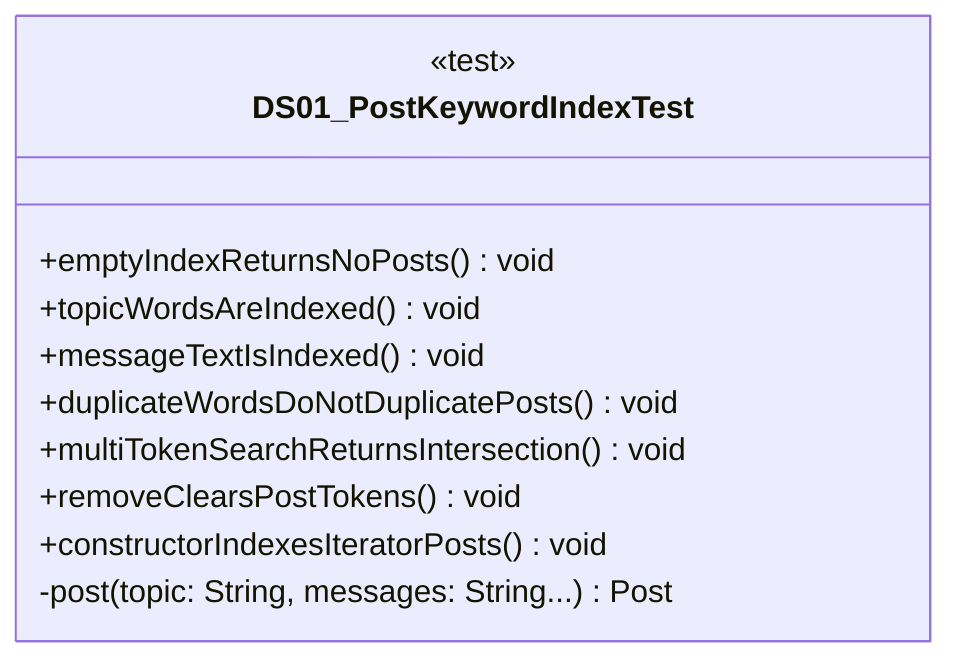

# DS01_PostKeywordIndexTest.java

## Explanation

This test file defines the DS01_PostKeywordIndexTest class in the hackathon package. It belongs to test/Mock_hackathon/DataStructures in the COMP2100 MiniLab codebase and verifies behavior of the ds01 post keyword index implementation. It uses JUnit 4 style testing through org.junit imports. Key methods include emptyIndexReturnsNoPosts, topicWordsAreIndexed, messageTextIsIndexed, duplicateWordsDoNotDuplicatePosts, multiTokenSearchReturnsIntersection.

## Complexity

Test complexity depends on the tested scenario and input size; most unit tests use small fixed-size inputs.

## UML



## Code
```java
package hackathon;

import dao.model.Message;
import dao.model.Post;
import java.util.Arrays;
import java.util.Collections;
import java.util.UUID;
import org.junit.Test;
import static org.junit.Assert.*;

/**
 * Tests DS01: Post keyword inverted index.
 */
public class DS01_PostKeywordIndexTest {
    // Verifies that searching an empty post index returns no posts.
    @Test
    public void emptyIndexReturnsNoPosts() {
        DS01_PostKeywordIndex index = new DS01_PostKeywordIndex();
        assertTrue(index.search("dao").isEmpty());
        assertEquals(0, index.size());
    }

    // Verifies that topic words are indexed case-insensitively.
    @Test
    public void topicWordsAreIndexed() {
        DS01_PostKeywordIndex index = new DS01_PostKeywordIndex();
        Post post = post("DAO Pattern Review");
        index.add(post);
        assertEquals(Collections.singletonList(post), index.search("dao"));
        assertEquals(Collections.singletonList(post), index.search("PATTERN"));
    }

    // Verifies that message text contributes to search results.
    @Test
    public void messageTextIsIndexed() {
        DS01_PostKeywordIndex index = new DS01_PostKeywordIndex();
        Post post = post("Project", "Review persistence helpers", "Check CSV escaping");
        index.add(post);
        assertEquals(Collections.singletonList(post), index.search("csv"));
    }

    // Verifies that duplicate words do not duplicate posts.
    @Test
    public void duplicateWordsDoNotDuplicatePosts() {
        DS01_PostKeywordIndex index = new DS01_PostKeywordIndex();
        Post post = post("DAO DAO DAO");
        index.add(post);
        assertEquals(1, index.search("dao").size());
        assertEquals(1, index.frequency("dao"));
    }

    // Verifies that multi-token queries return intersections.
    @Test
    public void multiTokenSearchReturnsIntersection() {
        DS01_PostKeywordIndex index = new DS01_PostKeywordIndex();
        Post daoPost = post("DAO persistence");
        Post graphPost = post("Graph persistence");
        index.add(daoPost);
        index.add(graphPost);
        assertEquals(Collections.singletonList(daoPost), index.search("dao persistence"));
    }

    // Verifies that removing a post clears every indexed token.
    @Test
    public void removeClearsPostTokens() {
        DS01_PostKeywordIndex index = new DS01_PostKeywordIndex();
        Post post = post("Search tokens", "body token");
        index.add(post);
        assertTrue(index.remove(post));
        assertTrue(index.search("token").isEmpty());
        assertFalse(index.remove(post));
    }

    // Verifies that the iterator constructor indexes all posts.
    @Test
    public void constructorIndexesIteratorPosts() {
        Post first = post("alpha beta");
        Post second = post("beta gamma");
        DS01_PostKeywordIndex index = new DS01_PostKeywordIndex(Arrays.asList(first, second).iterator());
        assertEquals(2, index.frequency("beta"));
    }

    // Creates a MiniLab Post with optional Message records.
    private Post post(String topic, String... messages) {
        UUID poster = UUID.randomUUID();
        Post post = new Post(UUID.randomUUID(), poster, topic);
        for (String text : messages) {
            post.messages.insert(new Message(UUID.randomUUID(), poster, post.id, System.currentTimeMillis(), text));
        }
        return post;
    }
}

```
