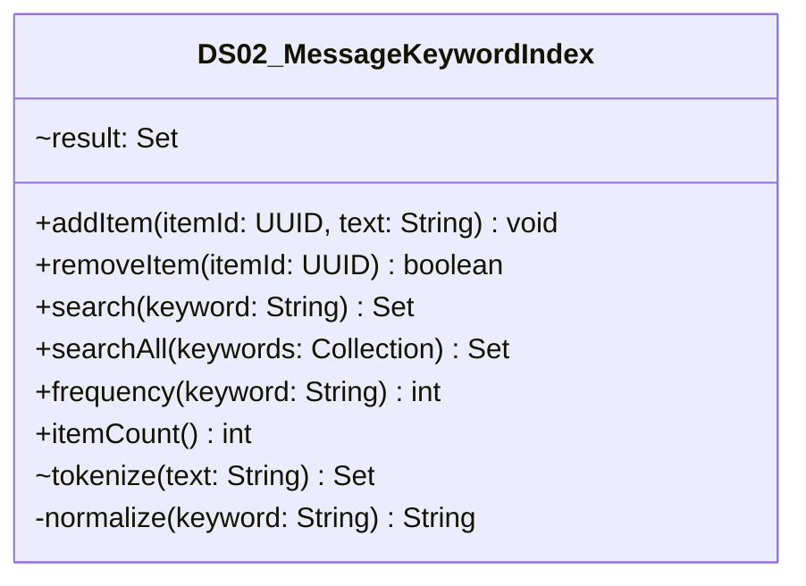

# DS02_MessageKeywordIndex.java

## Explanation

This file defines the DS02_MessageKeywordIndex class in the Mock_hackathon.DataStructures package. It belongs to src/Mock_hackathon/DataStructures in the COMP2100 MiniLab codebase and contains implementation logic for its codebase module. Key methods include addItem, removeItem, search, searchAll, frequency.

## Complexity

Complexity depends on the methods used in this class. Review loops, collection operations, and persistence calls for exact bounds.

## UML



## Code
```java
package Mock_hackathon.DataStructures;

import java.util.Collection;
import java.util.Collections;
import java.util.HashMap;
import java.util.LinkedHashSet;
import java.util.Locale;
import java.util.Map;
import java.util.Set;
import java.util.UUID;

/**
 * DS02: Message keyword inverted index.
 *
 * This mock hackathon implementation documents a concrete data structure
 * that is compatible with the COMP2100 MiniLab backend. The class uses
 * UUID, String, collection, and Path-oriented APIs so it can be studied
 * without changing the original dao, sorteddata, persistentdata, or
 * userstate packages.
 *
 * It demonstrates how an indexed, ordered, cached, or graph-based helper could support MiniLab posts, messages, users, and feeds without scanning every record.
 *
 * Implementation notes:
 * - Map/set buckets prevent duplicate ids while still supporting fast membership checks.
 *
 * Key invariants:
 * - Stored collections are kept behind small public methods instead of exposing mutable internals.
 * - Null or empty inputs are handled consistently so callers can use the helper safely in DAO-style code.
 * - Lookup/update behavior is deterministic, which keeps tests and demos reproducible.
 */
public class DS02_MessageKeywordIndex {
    /**
     * {@code index} stores keyed lookup data so operations avoid unnecessary linear scans.
     * Declared as {@code Map<String, Set<UUID>>} to match the task's storage needs.
     * This field belongs to DS02 and is intentionally private to protect invariants.
     */
    private final Map<String, Set<UUID>> index = new HashMap<>();
    /**
     * {@code reverseIndex} stores keyed lookup data so operations avoid unnecessary linear scans.
     * Declared as {@code Map<UUID, Set<String>>} to match the task's storage needs.
     * This field belongs to DS02 and is intentionally private to protect invariants.
     */
    private final Map<UUID, Set<String>> reverseIndex = new HashMap<>();

    /**
     * Adds or records data for this catalogue helper while preserving its internal invariants.
     *
     * Method role: addItem for DS02 (Message keyword inverted index).
     * Null/empty inputs follow the policy implemented in the method body.
     * @param itemId stable identifier or key supplied by the caller
     * @param text text input that the method normalizes, matches, formats, or persists
     */
    public void addItem(UUID itemId, String text) {
        if (itemId == null) return;
        removeItem(itemId);
        Set<String> tokens = tokenize(text);
        reverseIndex.put(itemId, tokens);
        for (String token : tokens) {
            index.computeIfAbsent(token, ignored -> new LinkedHashSet<>()).add(itemId);
        }
    }

    /**
     * Removes or reverses stored data and keeps related bookkeeping in sync.
     *
     * Method role: removeItem for DS02 (Message keyword inverted index).
     * Null/empty inputs follow the policy implemented in the method body.
     * @param itemId stable identifier or key supplied by the caller
     * @return defensive copy, status flag, or computed value derived from current state
     */
    public boolean removeItem(UUID itemId) {
        Set<String> tokens = reverseIndex.remove(itemId);
        if (tokens == null) return false;
        for (String token : tokens) {
            Set<UUID> ids = index.get(token);
            if (ids != null) {
                ids.remove(itemId);
                if (ids.isEmpty()) index.remove(token);
            }
        }
        return true;
    }

    /**
     * Queries the helper and returns a defensive or value-based result for callers.
     *
     * Method role: search for DS02 (Message keyword inverted index).
     * Null/empty inputs follow the policy implemented in the method body.
     * @param keyword text input that the method normalizes, matches, formats, or persists
     * @return defensive copy, status flag, or computed value derived from current state
     */
    public Set<UUID> search(String keyword) {
        Set<UUID> ids = index.get(normalize(keyword));
        return ids == null ? Collections.emptySet() : new LinkedHashSet<>(ids);
    }

    /**
     * Queries the helper and returns a defensive or value-based result for callers.
     *
     * Method role: searchAll for DS02 (Message keyword inverted index).
     * Null/empty inputs follow the policy implemented in the method body.
     * @param keywords text input that the method normalizes, matches, formats, or persists
     * @return defensive copy, status flag, or computed value derived from current state
     */
    public Set<UUID> searchAll(Collection<String> keywords) {
        if (keywords == null || keywords.isEmpty()) return Collections.emptySet();
        Set<UUID> result = null;
        for (String keyword : keywords) {
            Set<UUID> ids = search(keyword);
            result = result == null ? new LinkedHashSet<>(ids) : result;
            if (result != ids) result.retainAll(ids);
        }
        return result == null ? Collections.emptySet() : result;
    }

    /**
     * Reports a small summary value derived from the current task state.
     *
     * Method role: frequency for DS02 (Message keyword inverted index).
     * Null/empty inputs follow the policy implemented in the method body.
     * @param keyword text input that the method normalizes, matches, formats, or persists
     * @return defensive copy, status flag, or computed value derived from current state
     */
    public int frequency(String keyword) {
        return search(keyword).size();
    }

    /**
     * Reports a small summary value derived from the current task state.
     *
     * Method role: itemCount for DS02 (Message keyword inverted index).
     * Null/empty inputs follow the policy implemented in the method body.
     * @return defensive copy, status flag, or computed value derived from current state
     */
    public int itemCount() {
        return reverseIndex.size();
    }

    static Set<String> tokenize(String text) {
        Set<String> tokens = new LinkedHashSet<>();
        if (text == null) return tokens;
        for (String token : text.toLowerCase(Locale.ROOT).split("[^a-z0-9]+")) {
            if (!token.isBlank()) tokens.add(token);
        }
        return tokens;
    }

    private static String normalize(String keyword) {
        return keyword == null ? "" : keyword.toLowerCase(Locale.ROOT).replaceAll("[^a-z0-9]+", "");
    }
}

```
