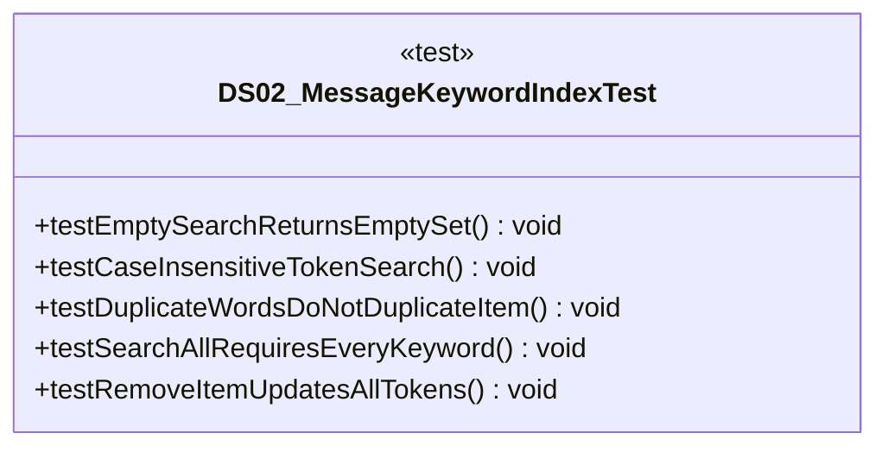

# DS02_MessageKeywordIndexTest.java

## Explanation

This test file defines the DS02_MessageKeywordIndexTest class in the Mock_hackathon.DataStructures package. It belongs to test/Mock_hackathon/DataStructures in the COMP2100 MiniLab codebase and verifies behavior of the ds02 message keyword index implementation. It uses JUnit 4 style testing through org.junit imports. Key methods include testEmptySearchReturnsEmptySet, testCaseInsensitiveTokenSearch, testDuplicateWordsDoNotDuplicateItem, testSearchAllRequiresEveryKeyword, testRemoveItemUpdatesAllTokens.

## Complexity

Test complexity depends on the tested scenario and input size; most unit tests use small fixed-size inputs.

## UML



## Code
```java
package Mock_hackathon.DataStructures;

import org.junit.Test;
import static org.junit.Assert.*;

import java.util.Arrays;
import java.util.Set;
import java.util.UUID;
/**
 * Tests DS02_MessageKeywordIndex.
 *
 * The cases exercise catalogue task DS02: Message keyword inverted index. They cover
 * empty inputs, normal behavior, repeated values, update/removal behavior,
 * and the edge cases most likely to appear in a MiniLab hackathon review.
 */
public class DS02_MessageKeywordIndexTest {
    /**
     * Verifies empty search returns empty set for DS02.
     * This case documents an expected edge or normal path for the matching implementation.
     */
    @Test
    public void testEmptySearchReturnsEmptySet() {
        assertTrue(new DS02_MessageKeywordIndex().search("java").isEmpty());
    }

    /**
     * Verifies case insensitive token search for DS02.
     * This case documents an expected edge or normal path for the matching implementation.
     */
    @Test
    public void testCaseInsensitiveTokenSearch() {
        DS02_MessageKeywordIndex index = new DS02_MessageKeywordIndex();
        UUID id = UUID.randomUUID();
        index.addItem(id, "Java MiniLab Feature");
        assertEquals(Set.of(id), index.search("JAVA"));
    }

    /**
     * Verifies duplicate words do not duplicate item for DS02.
     * This case documents an expected edge or normal path for the matching implementation.
     */
    @Test
    public void testDuplicateWordsDoNotDuplicateItem() {
        DS02_MessageKeywordIndex index = new DS02_MessageKeywordIndex();
        UUID id = UUID.randomUUID();
        index.addItem(id, "post post post");
        assertEquals(1, index.frequency("post"));
    }

    /**
     * Verifies search all requires every keyword for DS02.
     * This case documents an expected edge or normal path for the matching implementation.
     */
    @Test
    public void testSearchAllRequiresEveryKeyword() {
        DS02_MessageKeywordIndex index = new DS02_MessageKeywordIndex();
        UUID first = UUID.randomUUID();
        UUID second = UUID.randomUUID();
        index.addItem(first, "java csv post");
        index.addItem(second, "java graph");
        assertEquals(Set.of(first), index.searchAll(Arrays.asList("java", "csv")));
    }

    /**
     * Verifies remove item updates all tokens for DS02.
     * This case documents an expected edge or normal path for the matching implementation.
     */
    @Test
    public void testRemoveItemUpdatesAllTokens() {
        DS02_MessageKeywordIndex index = new DS02_MessageKeywordIndex();
        UUID id = UUID.randomUUID();
        index.addItem(id, "temporary searchable value");
        assertTrue(index.removeItem(id));
        assertTrue(index.search("temporary").isEmpty());
        assertEquals(0, index.itemCount());
    }
}

```
