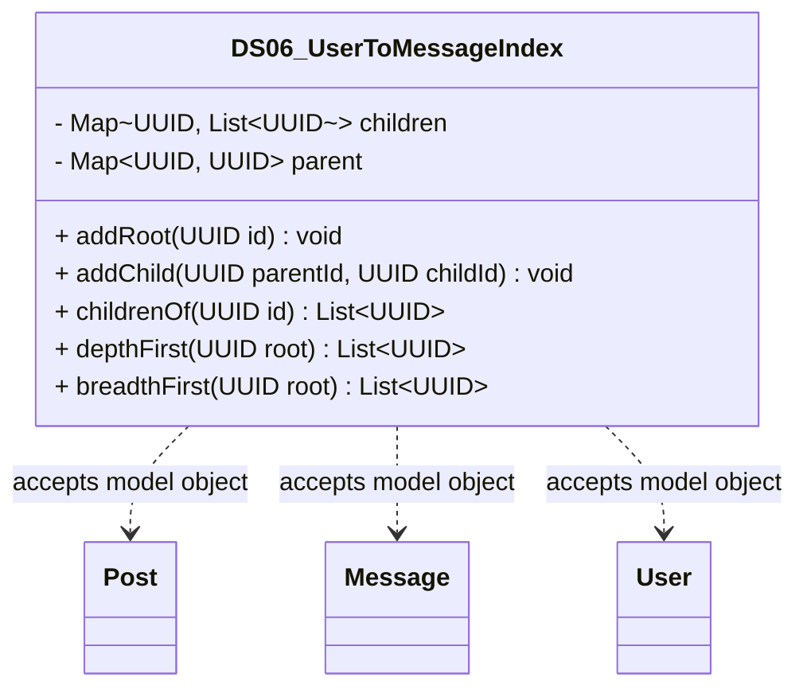

# DS06_UserToMessageIndex.java

## Explanation

DS06_UserToMessageIndex is a Mock_hackathon practice implementation for DS06: User-to-message index. It is stored separately from the original MiniLab packages so it can be studied as an extension-style hackathon task without changing the base codebase.

The feature is: Show all comments/messages by one user. The task is: Group messages by poster id.

This implementation imports dao.model.Post, dao.model.Message, and dao.model.User where relevant so the practice task can accept real MiniLab domain objects while still preserving a stable UUID/String API for isolated testing.

The class stores parent and child relationships for rooted traversal, direct child lookup, breadth-first order, and depth-first order.

Important edge cases are handled directly in code and tests: empty input, duplicate data, missing records, replacement or removal behavior, and invalid keys where relevant. This makes the class suitable for a mini project hackathon because it demonstrates the core behavior clearly while remaining small enough to modify under time pressure.

A Test Case block is attached to this implementation topic with JUnit 4 coverage for the DS06 catalogue behavior.

## Complexity

Software Architecture and UML Description:

DS06_UserToMessageIndex is a Mock_hackathon practice extension that sits beside the DAO/model layer. It imports dao.model.Post, dao.model.Message, and dao.model.User so callers can pass real MiniLab domain objects, while the implementation stores independent ids, tokens, scores, queues, ranges, or graph links internally.

In UML, draw dashed dependency arrows from this class to Post, Message, and User because it reads their public fields or record accessors but does not own their lifecycle. Internal maps, queues, nodes, and helper entries are implementation details owned by this class; show them with composition only if the diagram expands the data structure internals.

PlantUML guidance:
DS06_UserToMessageIndex ..> Post : reads post id/topic
DS06_UserToMessageIndex ..> Message : reads message id/text/timestamp
DS06_UserToMessageIndex ..> User : reads user id/username

## UML



## Code
```java
package hackathon;

import dao.model.Message;
import dao.model.Post;
import dao.model.User;
import java.util.ArrayDeque;
import java.util.ArrayList;
import java.util.Collections;
import java.util.HashMap;
import java.util.LinkedHashMap;
import java.util.List;
import java.util.Map;
import java.util.Objects;
import java.util.Optional;
import java.util.Queue;
import java.util.UUID;

/**
 * DS06 practice implementation for user-to-message index.
 */
public class DS06_UserToMessageIndex {
    private final Map<UUID, List<UUID>> children = new LinkedHashMap<>();
    private final Map<UUID, UUID> parent = new HashMap<>();

    // Creates an empty tree index.
    public DS06_UserToMessageIndex() {
    }

    // Adds a root node if it is not already present.
    public void addRoot(UUID id) {
        children.computeIfAbsent(Objects.requireNonNull(id, "id"), key -> new ArrayList<>());
    }

    // Adds a child below a parent node.
    public void addChild(UUID parentId, UUID childId) {
        addRoot(parentId);
        addRoot(childId);
        children.get(parentId).add(childId);
        parent.put(childId, parentId);
    }

    // Returns direct children of a node.
    public List<UUID> childrenOf(UUID id) {
        return new ArrayList<>(children.getOrDefault(id, Collections.emptyList()));
    }

    // Returns nodes in depth-first order from a root.
    public List<UUID> depthFirst(UUID root) {
        List<UUID> result = new ArrayList<>();
        walkDepth(root, result);
        return result;
    }

    // Returns nodes in breadth-first order from a root.
    public List<UUID> breadthFirst(UUID root) {
        List<UUID> result = new ArrayList<>();
        Queue<UUID> queue = new ArrayDeque<>();
        queue.add(root);
        while (!queue.isEmpty()) {
            UUID current = queue.remove();
            if (!children.containsKey(current)) {
                continue;
            }
            result.add(current);
            queue.addAll(children.get(current));
        }
        return result;
    }

    // Returns the parent of a node when known.
    public Optional<UUID> parentOf(UUID id) {
        return Optional.ofNullable(parent.get(id));
    }

    // Counts nodes known to the tree.
    public int nodeCount() {
        return children.size();
    }

    // Walks a tree recursively in depth-first order.
    private void walkDepth(UUID node, List<UUID> result) {
        if (!children.containsKey(node)) {
            return;
        }
        result.add(node);
        for (UUID child : children.get(node)) {
            walkDepth(child, result);
        }
    }
    // Adds a MiniLab Post as a root node.
    public void addPostRoot(Post post) {
        if (post != null) {
            addRoot(post.id);
        }
    }

    // Adds a MiniLab Message below its thread id.
    public void addMessageUnderThread(Message message) {
        if (message != null) {
            addChild(message.thread(), message.id());
        }
    }

    // Adds a MiniLab User as a root node.
    public void addUserRoot(User user) {
        if (user != null) {
            addRoot(user.id());
        }
    }


}

```
