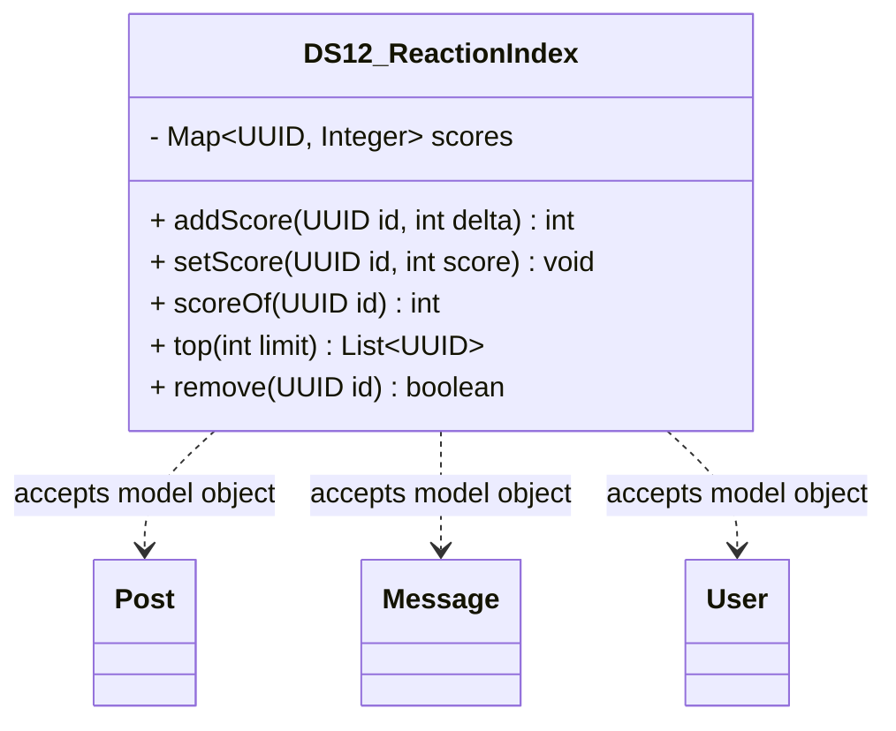

# DS12_ReactionIndex.java

## Explanation

DS12_ReactionIndex is a Mock_hackathon practice implementation for DS12: Reaction index. It is stored separately from the original MiniLab packages so it can be studied as an extension-style hackathon task without changing the base codebase.

The feature is: Track likes/upvotes/downvotes per target. The task is: Prevent duplicate reaction by same user and support reaction type changes.

This implementation imports dao.model.Post, dao.model.Message, and dao.model.User where relevant so the practice task can accept real MiniLab domain objects while still preserving a stable UUID/String API for isolated testing.

The class stores integer scores per id and can update, replace, rank, and remove scores for leaderboard-style tasks.

Important edge cases are handled directly in code and tests: empty input, duplicate data, missing records, replacement or removal behavior, and invalid keys where relevant. This makes the class suitable for a mini project hackathon because it demonstrates the core behavior clearly while remaining small enough to modify under time pressure.

A Test Case block is attached to this implementation topic with JUnit 4 coverage for the DS12 catalogue behavior.

## Complexity

Software Architecture and UML Description:

DS12_ReactionIndex is a Mock_hackathon practice extension that sits beside the DAO/model layer. It imports dao.model.Post, dao.model.Message, and dao.model.User so callers can pass real MiniLab domain objects, while the implementation stores independent ids, tokens, scores, queues, ranges, or graph links internally.

In UML, draw dashed dependency arrows from this class to Post, Message, and User because it reads their public fields or record accessors but does not own their lifecycle. Internal maps, queues, nodes, and helper entries are implementation details owned by this class; show them with composition only if the diagram expands the data structure internals.

PlantUML guidance:
DS12_ReactionIndex ..> Post : reads post id/topic
DS12_ReactionIndex ..> Message : reads message id/text/timestamp
DS12_ReactionIndex ..> User : reads user id/username

## UML



## Code
```java
package hackathon;

import dao.model.Message;
import dao.model.Post;
import dao.model.User;
import java.util.HashMap;
import java.util.List;
import java.util.Map;
import java.util.Objects;
import java.util.UUID;

/**
 * DS12 practice implementation for reaction index.
 */
public class DS12_ReactionIndex {
    private final Map<UUID, Integer> scores = new HashMap<>();

    // Creates an empty counter index.
    public DS12_ReactionIndex() {
    }

    // Adds a score delta to an id.
    public int addScore(UUID id, int delta) {
        Objects.requireNonNull(id, "id");
        int next = scoreOf(id) + delta;
        scores.put(id, next);
        return next;
    }

    // Sets an absolute score for an id.
    public void setScore(UUID id, int score) {
        Objects.requireNonNull(id, "id");
        scores.put(id, score);
    }

    // Returns the score for an id.
    public int scoreOf(UUID id) {
        return scores.getOrDefault(id, 0);
    }

    // Returns ids ordered by score descending.
    public List<UUID> top(int limit) {
        return scores.entrySet().stream()
            .sorted((left, right) -> Integer.compare(right.getValue(), left.getValue()))
            .limit(Math.max(0, limit))
            .map(Map.Entry::getKey)
            .toList();
    }

    // Removes an id from the counter.
    public boolean remove(UUID id) {
        return scores.remove(id) != null;
    }

    // Returns how many ids have scores.
    public int size() {
        return scores.size();
    }
    // Adds a score delta for a MiniLab Post.
    public int addPostScore(Post post, int delta) {
        return post == null ? 0 : addScore(post.id, delta);
    }

    // Adds a score delta for a MiniLab Message.
    public int addMessageScore(Message message, int delta) {
        return message == null ? 0 : addScore(message.id(), delta);
    }

    // Adds a score delta for a MiniLab User.
    public int addUserScore(User user, int delta) {
        return user == null ? 0 : addScore(user.id(), delta);
    }


}

```
