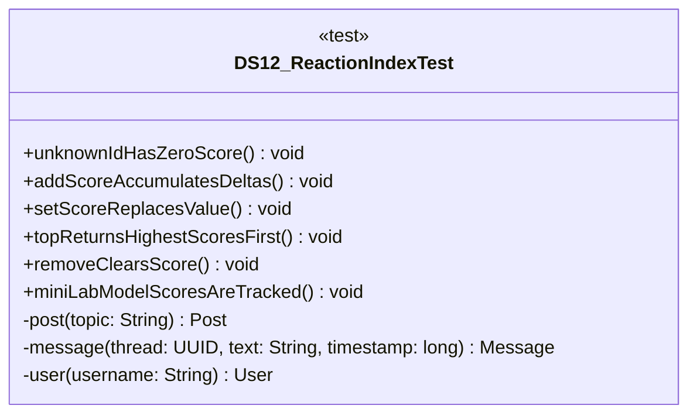

# DS12_ReactionIndexTest.java

## Explanation

This test file defines the DS12_ReactionIndexTest class in the hackathon package. It belongs to test/Mock_hackathon/DataStructures in the COMP2100 MiniLab codebase and verifies behavior of the ds12 reaction index implementation. It uses JUnit 4 style testing through org.junit imports. Key methods include unknownIdHasZeroScore, addScoreAccumulatesDeltas, setScoreReplacesValue, topReturnsHighestScoresFirst, removeClearsScore.

## Complexity

Test complexity depends on the tested scenario and input size; most unit tests use small fixed-size inputs.

## UML



## Code
```java
package hackathon;

import dao.model.Message;
import dao.model.Post;
import dao.model.User;
import java.util.UUID;
import org.junit.Test;
import static org.junit.Assert.*;

/**
 * Tests DS12: Reaction index.
 */
public class DS12_ReactionIndexTest {
    // Verifies that unknown ids have zero score.
    @Test
    public void unknownIdHasZeroScore() {
        DS12_ReactionIndex counter = new DS12_ReactionIndex();
        assertEquals(0, counter.scoreOf(UUID.randomUUID()));
    }

    // Verifies that score deltas accumulate.
    @Test
    public void addScoreAccumulatesDeltas() {
        DS12_ReactionIndex counter = new DS12_ReactionIndex();
        UUID id = UUID.randomUUID();
        counter.addScore(id, 3);
        assertEquals(5, counter.addScore(id, 2));
    }

    // Verifies that setScore replaces the old value.
    @Test
    public void setScoreReplacesValue() {
        DS12_ReactionIndex counter = new DS12_ReactionIndex();
        UUID id = UUID.randomUUID();
        counter.addScore(id, 3);
        counter.setScore(id, 10);
        assertEquals(10, counter.scoreOf(id));
    }

    // Verifies that top returns highest scores first.
    @Test
    public void topReturnsHighestScoresFirst() {
        DS12_ReactionIndex counter = new DS12_ReactionIndex();
        UUID low = UUID.randomUUID();
        UUID high = UUID.randomUUID();
        counter.setScore(low, 1);
        counter.setScore(high, 9);
        assertEquals(high, counter.top(1).get(0));
    }

    // Verifies that removing an id clears its score.
    @Test
    public void removeClearsScore() {
        DS12_ReactionIndex counter = new DS12_ReactionIndex();
        UUID id = UUID.randomUUID();
        counter.setScore(id, 4);
        assertTrue(counter.remove(id));
        assertEquals(0, counter.scoreOf(id));
    }
    // Verifies MiniLab model objects can receive scores.
    @Test
    public void miniLabModelScoresAreTracked() {
        DS12_ReactionIndex counter = new DS12_ReactionIndex();
        Post post = post("score");
        Message message = message(post.id, "reply", 5L);
        User user = user("scoreduser");
        assertEquals(3, counter.addPostScore(post, 3));
        assertEquals(2, counter.addMessageScore(message, 2));
        assertEquals(1, counter.addUserScore(user, 1));
    }

    // Creates a MiniLab Post for integration tests.
    private Post post(String topic) {
        return new Post(UUID.randomUUID(), UUID.randomUUID(), topic);
    }

    // Creates a MiniLab Message for integration tests.
    private Message message(UUID thread, String text, long timestamp) {
        return new Message(UUID.randomUUID(), UUID.randomUUID(), thread, timestamp, text);
    }

    // Creates a MiniLab User for integration tests.
    private User user(String username) {
        return new User(UUID.randomUUID(), User.Role.Member, username, "password");
    }


}

```
