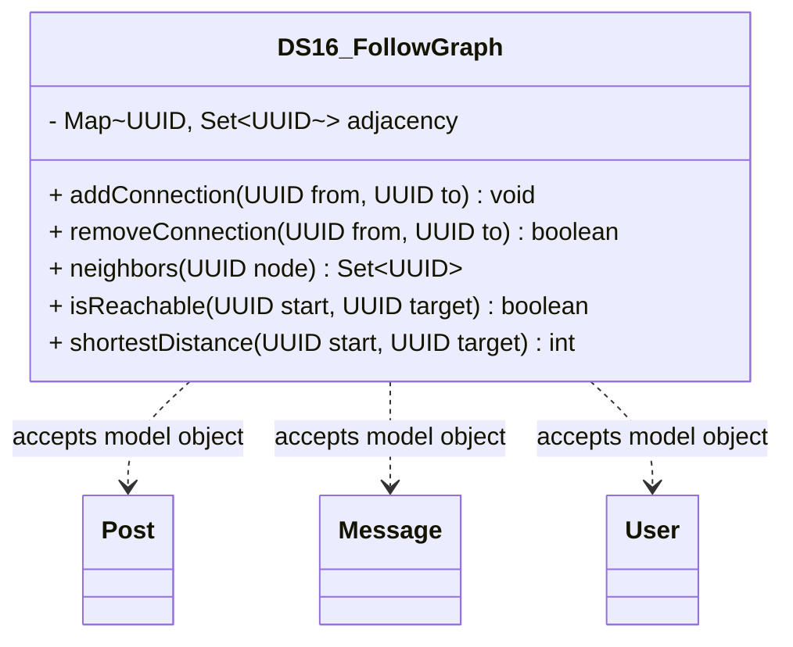

# DS16_FollowGraph.java

## Explanation

DS16_FollowGraph is a Mock_hackathon practice implementation for DS16: Follow graph. It is stored separately from the original MiniLab packages so it can be studied as an extension-style hackathon task without changing the base codebase.

The feature is: Represent user follow relationships. The task is: Directed graph where follower -> followee.

This implementation imports dao.model.Post, dao.model.Message, and dao.model.User where relevant so the practice task can accept real MiniLab domain objects while still preserving a stable UUID/String API for isolated testing.

The class stores a directed adjacency map and supports adding/removing connections, neighbor lookup, reachability, shortest unweighted distance, and graph counts.

Important edge cases are handled directly in code and tests: empty input, duplicate data, missing records, replacement or removal behavior, and invalid keys where relevant. This makes the class suitable for a mini project hackathon because it demonstrates the core behavior clearly while remaining small enough to modify under time pressure.

A Test Case block is attached to this implementation topic with JUnit 4 coverage for the DS16 catalogue behavior.

## Complexity

Software Architecture and UML Description:

DS16_FollowGraph is a Mock_hackathon practice extension that sits beside the DAO/model layer. It imports dao.model.Post, dao.model.Message, and dao.model.User so callers can pass real MiniLab domain objects, while the implementation stores independent ids, tokens, scores, queues, ranges, or graph links internally.

In UML, draw dashed dependency arrows from this class to Post, Message, and User because it reads their public fields or record accessors but does not own their lifecycle. Internal maps, queues, nodes, and helper entries are implementation details owned by this class; show them with composition only if the diagram expands the data structure internals.

PlantUML guidance:
DS16_FollowGraph ..> Post : reads post id/topic
DS16_FollowGraph ..> Message : reads message id/text/timestamp
DS16_FollowGraph ..> User : reads user id/username

## UML



## Code
```java
package hackathon;

import dao.model.Message;
import dao.model.Post;
import dao.model.User;
import java.util.ArrayDeque;
import java.util.Collections;
import java.util.HashMap;
import java.util.LinkedHashMap;
import java.util.LinkedHashSet;
import java.util.Map;
import java.util.Objects;
import java.util.Queue;
import java.util.Set;
import java.util.UUID;

/**
 * DS16 practice implementation for follow graph.
 */
public class DS16_FollowGraph {
    private final Map<UUID, Set<UUID>> adjacency = new LinkedHashMap<>();

    // Creates an empty directed graph.
    public DS16_FollowGraph() {
    }

    // Adds a directed connection between two ids.
    public void addConnection(UUID from, UUID to) {
        Objects.requireNonNull(from, "from");
        Objects.requireNonNull(to, "to");
        adjacency.computeIfAbsent(from, key -> new LinkedHashSet<>()).add(to);
        adjacency.computeIfAbsent(to, key -> new LinkedHashSet<>());
    }

    // Removes a directed connection if it exists.
    public boolean removeConnection(UUID from, UUID to) {
        Set<UUID> targets = adjacency.get(from);
        return targets != null && targets.remove(to);
    }

    // Returns neighbors reachable in one step.
    public Set<UUID> neighbors(UUID node) {
        return new LinkedHashSet<>(adjacency.getOrDefault(node, Collections.emptySet()));
    }

    // Checks whether a target can be reached from a start node.
    public boolean isReachable(UUID start, UUID target) {
        return shortestDistance(start, target) >= 0;
    }

    // Returns the shortest unweighted distance or -1 when unreachable.
    public int shortestDistance(UUID start, UUID target) {
        if (Objects.equals(start, target) && adjacency.containsKey(start)) {
            return 0;
        }
        Queue<UUID> queue = new ArrayDeque<>();
        Map<UUID, Integer> distance = new HashMap<>();
        queue.add(start);
        distance.put(start, 0);
        while (!queue.isEmpty()) {
            UUID current = queue.remove();
            for (UUID next : adjacency.getOrDefault(current, Collections.emptySet())) {
                if (distance.containsKey(next)) {
                    continue;
                }
                int nextDistance = distance.get(current) + 1;
                if (next.equals(target)) {
                    return nextDistance;
                }
                distance.put(next, nextDistance);
                queue.add(next);
            }
        }
        return -1;
    }

    // Counts directed edges in the graph.
    public int edgeCount() {
        int count = 0;
        for (Set<UUID> targets : adjacency.values()) {
            count += targets.size();
        }
        return count;
    }

    // Counts known nodes in the graph.
    public int nodeCount() {
        return adjacency.size();
    }
    // Adds a graph edge between two MiniLab posts.
    public void addPostRelationship(Post from, Post to) {
        if (from != null && to != null) {
            addConnection(from.id, to.id);
        }
    }

    // Adds a graph edge between two MiniLab users.
    public void addUserRelationship(User from, User to) {
        if (from != null && to != null) {
            addConnection(from.id(), to.id());
        }
    }

    // Adds a graph edge from a message thread to the message id.
    public void addThreadMessage(Message message) {
        if (message != null) {
            addConnection(message.thread(), message.id());
        }
    }


}

```
