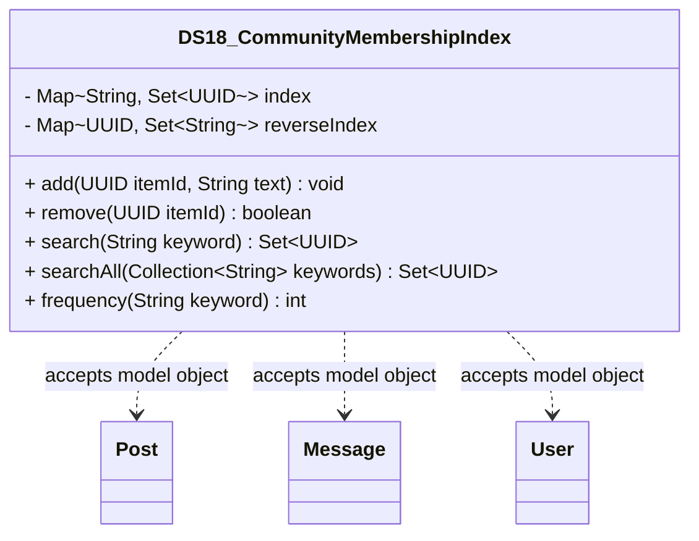

# DS18_CommunityMembershipIndex.java

## Explanation

DS18_CommunityMembershipIndex is a Mock_hackathon practice implementation for DS18: Community membership index. It is stored separately from the original MiniLab packages so it can be studied as an extension-style hackathon task without changing the base codebase.

The feature is: Track which users belong to each community. The task is: Map community id/name to member ids and roles.

This implementation imports dao.model.Post, dao.model.Message, and dao.model.User where relevant so the practice task can accept real MiniLab domain objects while still preserving a stable UUID/String API for isolated testing.

The class stores a normalized token-to-id index plus a reverse id-to-token index so add, remove, single keyword search, and multi-keyword intersection remain consistent.

Important edge cases are handled directly in code and tests: empty input, duplicate data, missing records, replacement or removal behavior, and invalid keys where relevant. This makes the class suitable for a mini project hackathon because it demonstrates the core behavior clearly while remaining small enough to modify under time pressure.

A Test Case block is attached to this implementation topic with JUnit 4 coverage for the DS18 catalogue behavior.

## Complexity

Software Architecture and UML Description:

DS18_CommunityMembershipIndex is a Mock_hackathon practice extension that sits beside the DAO/model layer. It imports dao.model.Post, dao.model.Message, and dao.model.User so callers can pass real MiniLab domain objects, while the implementation stores independent ids, tokens, scores, queues, ranges, or graph links internally.

In UML, draw dashed dependency arrows from this class to Post, Message, and User because it reads their public fields or record accessors but does not own their lifecycle. Internal maps, queues, nodes, and helper entries are implementation details owned by this class; show them with composition only if the diagram expands the data structure internals.

PlantUML guidance:
DS18_CommunityMembershipIndex ..> Post : reads post id/topic
DS18_CommunityMembershipIndex ..> Message : reads message id/text/timestamp
DS18_CommunityMembershipIndex ..> User : reads user id/username

## UML



## Code
```java
package hackathon;

import dao.model.Message;
import dao.model.Post;
import dao.model.User;
import java.util.Collection;
import java.util.Collections;
import java.util.HashMap;
import java.util.Iterator;
import java.util.LinkedHashSet;
import java.util.Locale;
import java.util.Map;
import java.util.Objects;
import java.util.Set;
import java.util.UUID;

/**
 * DS18 practice implementation for community membership index.
 */
public class DS18_CommunityMembershipIndex {
    private final Map<String, Set<UUID>> index = new HashMap<>();
    private final Map<UUID, Set<String>> reverseIndex = new HashMap<>();

    // Creates an empty keyword-style index.
    public DS18_CommunityMembershipIndex() {
    }

    // Adds an item to every token bucket found in the text.
    public void add(UUID itemId, String text) {
        Objects.requireNonNull(itemId, "itemId");
        remove(itemId);
        Set<String> tokens = tokenize(text);
        reverseIndex.put(itemId, tokens);
        for (String token : tokens) {
            index.computeIfAbsent(token, key -> new LinkedHashSet<>()).add(itemId);
        }
    }

    // Removes an item from all token buckets.
    public boolean remove(UUID itemId) {
        Set<String> tokens = reverseIndex.remove(itemId);
        if (tokens == null) {
            return false;
        }
        for (String token : tokens) {
            Set<UUID> bucket = index.get(token);
            if (bucket != null) {
                bucket.remove(itemId);
                if (bucket.isEmpty()) {
                    index.remove(token);
                }
            }
        }
        return true;
    }

    // Returns matching item ids for one normalized keyword.
    public Set<UUID> search(String keyword) {
        String token = normalize(keyword);
        if (token.isEmpty()) {
            return Collections.emptySet();
        }
        return new LinkedHashSet<>(index.getOrDefault(token, Collections.emptySet()));
    }

    // Returns item ids that match every keyword.
    public Set<UUID> searchAll(Collection<String> keywords) {
        if (keywords == null || keywords.isEmpty()) {
            return Collections.emptySet();
        }
        Iterator<String> iterator = keywords.iterator();
        Set<UUID> result = search(iterator.next());
        while (iterator.hasNext()) {
            result.retainAll(search(iterator.next()));
        }
        return result;
    }

    // Returns how many items contain the keyword.
    public int frequency(String keyword) {
        return search(keyword).size();
    }

    // Returns the number of indexed items.
    public int itemCount() {
        return reverseIndex.size();
    }

    // Splits text into normalized unique tokens.
    private Set<String> tokenize(String text) {
        Set<String> tokens = new LinkedHashSet<>();
        for (String raw : String.valueOf(text).split("[^A-Za-z0-9]+")) {
            String token = normalize(raw);
            if (!token.isEmpty()) {
                tokens.add(token);
            }
        }
        return tokens;
    }

    // Normalizes a token for lookup.
    private String normalize(String token) {
        return String.valueOf(token).toLowerCase(Locale.ROOT).trim();
    }
    // Adds a MiniLab Post by indexing its topic text.
    public void addPost(Post post) {
        if (post != null) {
            add(post.id, post.topic);
        }
    }

    // Adds a MiniLab Message by indexing its message text.
    public void addMessage(Message message) {
        if (message != null) {
            add(message.id(), message.message());
        }
    }

    // Adds a MiniLab User by indexing its username.
    public void addUser(User user) {
        if (user != null) {
            add(user.id(), user.username());
        }
    }


}

```
