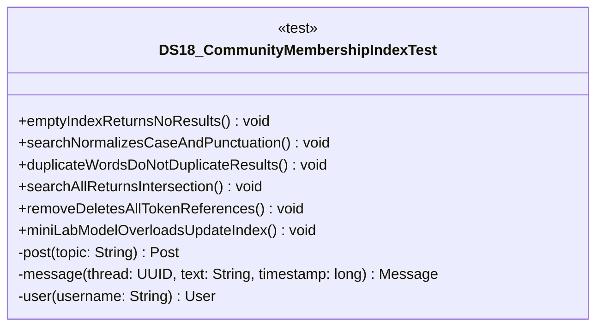

# DS18_CommunityMembershipIndexTest.java

## Explanation

This test file defines the DS18_CommunityMembershipIndexTest class in the hackathon package. It belongs to test/Mock_hackathon/DataStructures in the COMP2100 MiniLab codebase and verifies behavior of the ds18 community membership index implementation. It uses JUnit 4 style testing through org.junit imports. Key methods include emptyIndexReturnsNoResults, searchNormalizesCaseAndPunctuation, duplicateWordsDoNotDuplicateResults, searchAllReturnsIntersection, removeDeletesAllTokenReferences.

## Complexity

Test complexity depends on the tested scenario and input size; most unit tests use small fixed-size inputs.

## UML



## Code
```java
package hackathon;

import dao.model.Message;
import dao.model.Post;
import dao.model.User;
import java.util.Arrays;
import java.util.Collections;
import java.util.UUID;
import org.junit.Test;
import static org.junit.Assert.*;

/**
 * Tests DS18: Community membership index.
 */
public class DS18_CommunityMembershipIndexTest {
    // Verifies that an empty index returns no ids.
    @Test
    public void emptyIndexReturnsNoResults() {
        DS18_CommunityMembershipIndex index = new DS18_CommunityMembershipIndex();
        assertTrue(index.search("missing").isEmpty());
        assertEquals(0, index.itemCount());
    }

    // Verifies that lookup is case-insensitive and punctuation-safe.
    @Test
    public void searchNormalizesCaseAndPunctuation() {
        DS18_CommunityMembershipIndex index = new DS18_CommunityMembershipIndex();
        UUID id = UUID.randomUUID();
        index.add(id, "Hello, MiniLab!");
        assertEquals(Collections.singleton(id), index.search("hello"));
        assertEquals(Collections.singleton(id), index.search("MINILAB"));
    }

    // Verifies that repeated words do not duplicate ids.
    @Test
    public void duplicateWordsDoNotDuplicateResults() {
        DS18_CommunityMembershipIndex index = new DS18_CommunityMembershipIndex();
        UUID id = UUID.randomUUID();
        index.add(id, "dao dao dao");
        assertEquals(1, index.search("dao").size());
    }

    // Verifies that intersection search keeps only common matches.
    @Test
    public void searchAllReturnsIntersection() {
        DS18_CommunityMembershipIndex index = new DS18_CommunityMembershipIndex();
        UUID first = UUID.randomUUID();
        UUID second = UUID.randomUUID();
        index.add(first, "post dao test");
        index.add(second, "post graph");
        assertEquals(Collections.singleton(first), index.searchAll(Arrays.asList("post", "dao")));
    }

    // Verifies that removing an item updates every token bucket.
    @Test
    public void removeDeletesAllTokenReferences() {
        DS18_CommunityMembershipIndex index = new DS18_CommunityMembershipIndex();
        UUID id = UUID.randomUUID();
        index.add(id, "alpha beta");
        assertTrue(index.remove(id));
        assertTrue(index.search("alpha").isEmpty());
        assertFalse(index.remove(id));
    }
    // Verifies MiniLab Post Message and User overloads update the index.
    @Test
    public void miniLabModelOverloadsUpdateIndex() {
        DS18_CommunityMembershipIndex index = new DS18_CommunityMembershipIndex();
        Post post = post("DAO hashtag search");
        Message message = message(post.id, "reply content", 10L);
        User user = user("miniuser");
        index.addPost(post);
        index.addMessage(message);
        index.addUser(user);
        assertTrue(index.search("dao").contains(post.id));
        assertTrue(index.search("reply").contains(message.id()));
        assertTrue(index.search("miniuser").contains(user.id()));
    }

    // Creates a MiniLab Post for integration tests.
    private Post post(String topic) {
        return new Post(UUID.randomUUID(), UUID.randomUUID(), topic);
    }

    // Creates a MiniLab Message for integration tests.
    private Message message(UUID thread, String text, long timestamp) {
        return new Message(UUID.randomUUID(), UUID.randomUUID(), thread, timestamp, text);
    }

    // Creates a MiniLab User for integration tests.
    private User user(String username) {
        return new User(UUID.randomUUID(), User.Role.Member, username, "password");
    }


}

```
