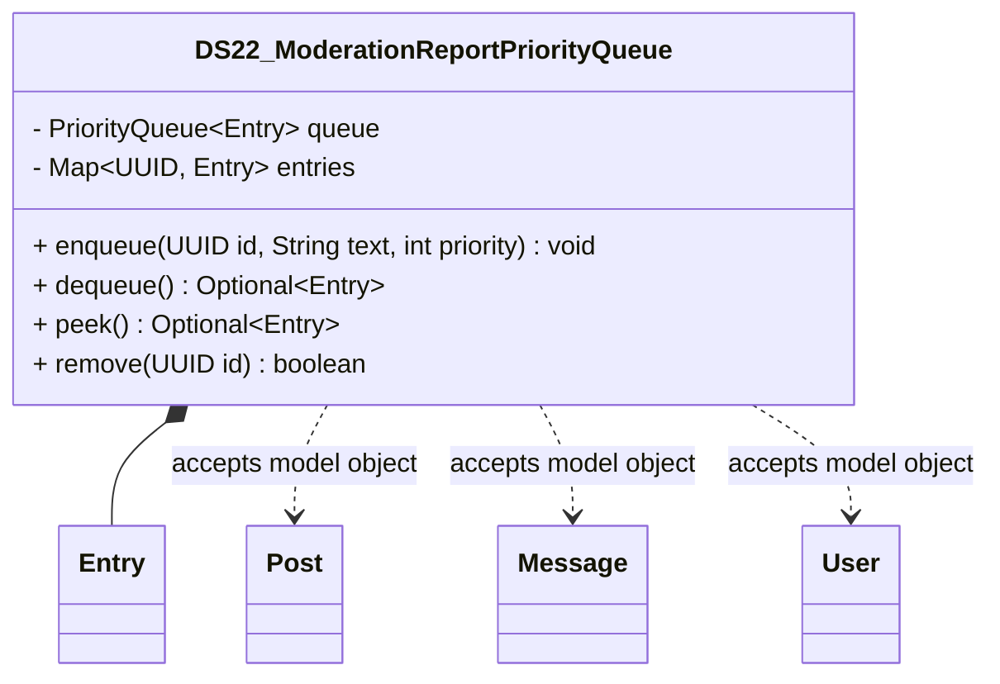

# DS22_ModerationReportPriorityQueue.java

## Explanation

DS22_ModerationReportPriorityQueue is a Mock_hackathon practice implementation for DS22: Moderation report priority queue. It is stored separately from the original MiniLab packages so it can be studied as an extension-style hackathon task without changing the base codebase.

The feature is: Process reports by severity and age. The task is: Priority queue of report objects with stable comparator.

This implementation imports dao.model.Post, dao.model.Message, and dao.model.User where relevant so the practice task can accept real MiniLab domain objects while still preserving a stable UUID/String API for isolated testing.

The class stores prioritized entries in a priority queue with a map for fast replacement and removal by id.

Important edge cases are handled directly in code and tests: empty input, duplicate data, missing records, replacement or removal behavior, and invalid keys where relevant. This makes the class suitable for a mini project hackathon because it demonstrates the core behavior clearly while remaining small enough to modify under time pressure.

A Test Case block is attached to this implementation topic with JUnit 4 coverage for the DS22 catalogue behavior.

## Complexity

Software Architecture and UML Description:

DS22_ModerationReportPriorityQueue is a Mock_hackathon practice extension that sits beside the DAO/model layer. It imports dao.model.Post, dao.model.Message, and dao.model.User so callers can pass real MiniLab domain objects, while the implementation stores independent ids, tokens, scores, queues, ranges, or graph links internally.

In UML, draw dashed dependency arrows from this class to Post, Message, and User because it reads their public fields or record accessors but does not own their lifecycle. Internal maps, queues, nodes, and helper entries are implementation details owned by this class; show them with composition only if the diagram expands the data structure internals.

PlantUML guidance:
DS22_ModerationReportPriorityQueue ..> Post : reads post id/topic
DS22_ModerationReportPriorityQueue ..> Message : reads message id/text/timestamp
DS22_ModerationReportPriorityQueue ..> User : reads user id/username

## UML



## Code
```java
package hackathon;

import dao.model.Message;
import dao.model.Post;
import dao.model.User;
import java.util.HashMap;
import java.util.Map;
import java.util.Objects;
import java.util.Optional;
import java.util.PriorityQueue;
import java.util.UUID;

/**
 * DS22 practice implementation for moderation report priority queue.
 */
public class DS22_ModerationReportPriorityQueue {
    private final PriorityQueue<Entry> queue = new PriorityQueue<>();
    private final Map<UUID, Entry> entries = new HashMap<>();
    private long sequence;

    // Creates an empty priority queue.
    public DS22_ModerationReportPriorityQueue() {
    }

    // Adds or replaces an item with a priority.
    public void enqueue(UUID id, String text, int priority) {
        Objects.requireNonNull(id, "id");
        remove(id);
        Entry entry = new Entry(id, String.valueOf(text), priority, sequence++);
        entries.put(id, entry);
        queue.add(entry);
    }

    // Removes and returns the highest-priority item.
    public Optional<Entry> dequeue() {
        Entry entry = queue.poll();
        if (entry == null) {
            return Optional.empty();
        }
        entries.remove(entry.id);
        return Optional.of(entry);
    }

    // Returns the next item without removing it.
    public Optional<Entry> peek() {
        return Optional.ofNullable(queue.peek());
    }

    // Removes a queued item by id.
    public boolean remove(UUID id) {
        Entry entry = entries.remove(id);
        return entry != null && queue.remove(entry);
    }

    // Checks whether an id is currently queued.
    public boolean contains(UUID id) {
        return entries.containsKey(id);
    }

    // Returns the number of queued items.
    public int size() {
        return entries.size();
    }

    public static class Entry implements Comparable<Entry> {
        private final UUID id;
        private final String text;
        private final int priority;
        private final long sequence;

        // Creates an immutable queue entry.
        private Entry(UUID id, String text, int priority, long sequence) {
            this.id = id;
            this.text = text;
            this.priority = priority;
            this.sequence = sequence;
        }

        // Returns the queued item id.
        public UUID getId() {
            return id;
        }

        // Returns the queued item text.
        public String getText() {
            return text;
        }

        // Returns the queued item priority.
        public int getPriority() {
            return priority;
        }

        // Orders entries by priority and insertion sequence.
        @Override
        public int compareTo(Entry other) {
            int byPriority = Integer.compare(other.priority, priority);
            return byPriority != 0 ? byPriority : Long.compare(sequence, other.sequence);
        }
    }
    // Queues a MiniLab Post using its id and topic.
    public void enqueuePost(Post post, int priority) {
        if (post != null) {
            enqueue(post.id, post.topic, priority);
        }
    }

    // Queues a MiniLab Message using its id and body.
    public void enqueueMessage(Message message, int priority) {
        if (message != null) {
            enqueue(message.id(), message.message(), priority);
        }
    }

    // Queues a MiniLab User using its id and username.
    public void enqueueUser(User user, int priority) {
        if (user != null) {
            enqueue(user.id(), user.username(), priority);
        }
    }


}

```
