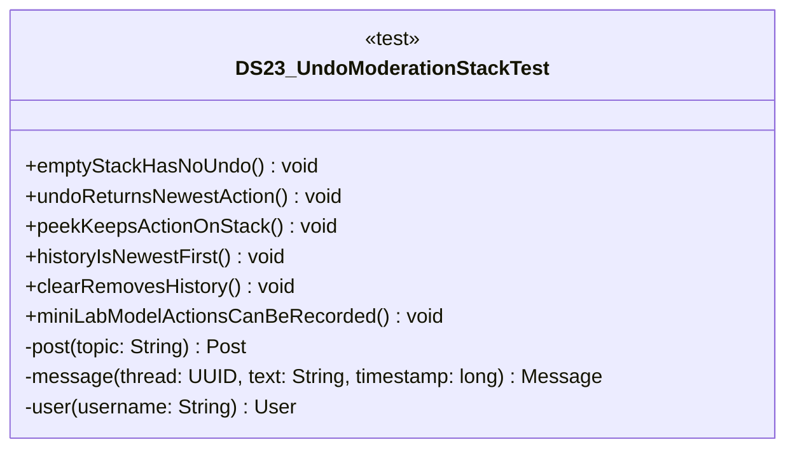

# DS23_UndoModerationStackTest.java

## Explanation

This test file defines the DS23_UndoModerationStackTest class in the hackathon package. It belongs to test/Mock_hackathon/DataStructures in the COMP2100 MiniLab codebase and verifies behavior of the ds23 undo moderation stack implementation. It uses JUnit 4 style testing through org.junit imports. Key methods include emptyStackHasNoUndo, undoReturnsNewestAction, peekKeepsActionOnStack, historyIsNewestFirst, clearRemovesHistory.

## Complexity

Test complexity depends on the tested scenario and input size; most unit tests use small fixed-size inputs.

## UML



## Code
```java
package hackathon;

import dao.model.Message;
import dao.model.Post;
import dao.model.User;
import java.util.Arrays;
import java.util.UUID;
import org.junit.Test;
import static org.junit.Assert.*;

/**
 * Tests DS23: Undo moderation stack.
 */
public class DS23_UndoModerationStackTest {
    // Verifies that an empty stack has no undo action.
    @Test
    public void emptyStackHasNoUndo() {
        DS23_UndoModerationStack stack = new DS23_UndoModerationStack();
        assertFalse(stack.undo().isPresent());
    }

    // Verifies that the newest action is undone first.
    @Test
    public void undoReturnsNewestAction() {
        DS23_UndoModerationStack stack = new DS23_UndoModerationStack();
        stack.push("first");
        stack.push("second");
        assertEquals("second", stack.undo().get());
    }

    // Verifies peek does not remove data.
    @Test
    public void peekKeepsActionOnStack() {
        DS23_UndoModerationStack stack = new DS23_UndoModerationStack();
        stack.push("edit");
        assertEquals("edit", stack.peek().get());
        assertEquals(1, stack.size());
    }

    // Verifies history order is newest first.
    @Test
    public void historyIsNewestFirst() {
        DS23_UndoModerationStack stack = new DS23_UndoModerationStack();
        stack.push("old");
        stack.push("new");
        assertEquals(Arrays.asList("new", "old"), stack.history());
    }

    // Verifies clear removes all actions.
    @Test
    public void clearRemovesHistory() {
        DS23_UndoModerationStack stack = new DS23_UndoModerationStack();
        stack.push("edit");
        stack.clear();
        assertEquals(0, stack.size());
    }
    // Verifies MiniLab model actions can be recorded on the stack.
    @Test
    public void miniLabModelActionsCanBeRecorded() {
        DS23_UndoModerationStack stack = new DS23_UndoModerationStack();
        Post post = post("edit");
        stack.pushPostEdit(post, "rename");
        stack.pushMessageEdit(message(post.id, "reply", 5L), "moderate");
        stack.pushUserAction(user("actor"), "login");
        assertEquals(3, stack.size());
        assertTrue(stack.peek().get().startsWith("user:"));
    }

    // Creates a MiniLab Post for integration tests.
    private Post post(String topic) {
        return new Post(UUID.randomUUID(), UUID.randomUUID(), topic);
    }

    // Creates a MiniLab Message for integration tests.
    private Message message(UUID thread, String text, long timestamp) {
        return new Message(UUID.randomUUID(), UUID.randomUUID(), thread, timestamp, text);
    }

    // Creates a MiniLab User for integration tests.
    private User user(String username) {
        return new User(UUID.randomUUID(), User.Role.Member, username, "password");
    }


}

```
