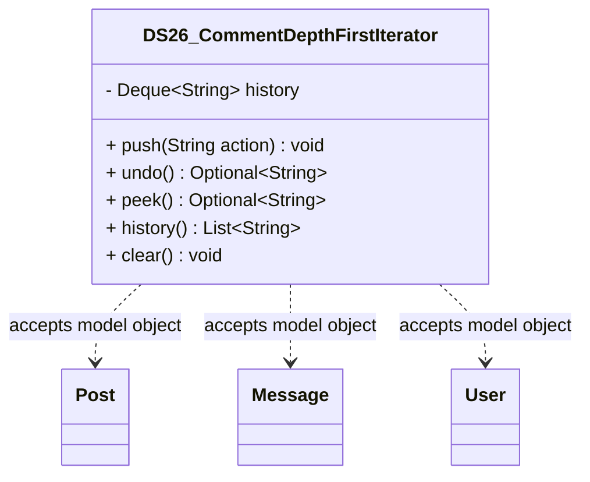

# DS26_CommentDepthFirstIterator.java

## Explanation

DS26_CommentDepthFirstIterator is a Mock_hackathon practice implementation for DS26: Comment depth-first iterator. It is stored separately from the original MiniLab packages so it can be studied as an extension-style hackathon task without changing the base codebase.

The feature is: Flatten nested comments in thread order. The task is: Stack-based DFS iterator.

This implementation imports dao.model.Post, dao.model.Message, and dao.model.User where relevant so the practice task can accept real MiniLab domain objects while still preserving a stable UUID/String API for isolated testing.

The class stores actions in a stack so recent history can be inspected, undone, listed, and cleared.

Important edge cases are handled directly in code and tests: empty input, duplicate data, missing records, replacement or removal behavior, and invalid keys where relevant. This makes the class suitable for a mini project hackathon because it demonstrates the core behavior clearly while remaining small enough to modify under time pressure.

A Test Case block is attached to this implementation topic with JUnit 4 coverage for the DS26 catalogue behavior.

## Complexity

Software Architecture and UML Description:

DS26_CommentDepthFirstIterator is a Mock_hackathon practice extension that sits beside the DAO/model layer. It imports dao.model.Post, dao.model.Message, and dao.model.User so callers can pass real MiniLab domain objects, while the implementation stores independent ids, tokens, scores, queues, ranges, or graph links internally.

In UML, draw dashed dependency arrows from this class to Post, Message, and User because it reads their public fields or record accessors but does not own their lifecycle. Internal maps, queues, nodes, and helper entries are implementation details owned by this class; show them with composition only if the diagram expands the data structure internals.

PlantUML guidance:
DS26_CommentDepthFirstIterator ..> Post : reads post id/topic
DS26_CommentDepthFirstIterator ..> Message : reads message id/text/timestamp
DS26_CommentDepthFirstIterator ..> User : reads user id/username

## UML



## Code
```java
package hackathon;

import dao.model.Message;
import dao.model.Post;
import dao.model.User;
import java.util.ArrayDeque;
import java.util.ArrayList;
import java.util.Deque;
import java.util.List;
import java.util.Optional;

/**
 * DS26 practice implementation for comment depth-first iterator.
 */
public class DS26_CommentDepthFirstIterator {
    private final Deque<String> history = new ArrayDeque<>();

    // Creates an empty history stack.
    public DS26_CommentDepthFirstIterator() {
    }

    // Pushes a new action onto the stack.
    public void push(String action) {
        history.push(String.valueOf(action));
    }

    // Removes and returns the most recent action.
    public Optional<String> undo() {
        return history.isEmpty() ? Optional.empty() : Optional.of(history.pop());
    }

    // Returns the most recent action without removing it.
    public Optional<String> peek() {
        return history.isEmpty() ? Optional.empty() : Optional.of(history.peek());
    }

    // Clears all saved history.
    public void clear() {
        history.clear();
    }

    // Returns actions from newest to oldest.
    public List<String> history() {
        return new ArrayList<>(history);
    }

    // Returns the number of saved actions.
    public int size() {
        return history.size();
    }
    // Records an edit action for a MiniLab Post.
    public void pushPostEdit(Post post, String action) {
        if (post != null) {
            push("post:" + post.id + ":" + String.valueOf(action));
        }
    }

    // Records an edit action for a MiniLab Message.
    public void pushMessageEdit(Message message, String action) {
        if (message != null) {
            push("message:" + message.id() + ":" + String.valueOf(action));
        }
    }

    // Records an action performed by a MiniLab User.
    public void pushUserAction(User user, String action) {
        if (user != null) {
            push("user:" + user.id() + ":" + String.valueOf(action));
        }
    }


}

```
