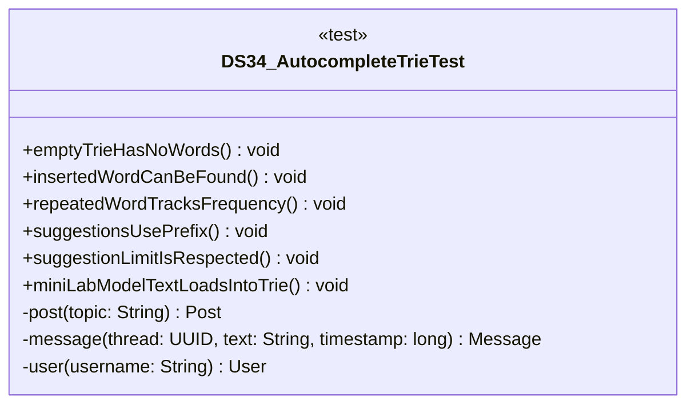

# DS34_AutocompleteTrieTest.java

## Explanation

This test file defines the DS34_AutocompleteTrieTest class in the hackathon package. It belongs to test/Mock_hackathon/DataStructures in the COMP2100 MiniLab codebase and verifies behavior of the ds34 autocomplete trie implementation. It uses JUnit 4 style testing through org.junit imports. Key methods include emptyTrieHasNoWords, insertedWordCanBeFound, repeatedWordTracksFrequency, suggestionsUsePrefix, suggestionLimitIsRespected.

## Complexity

Test complexity depends on the tested scenario and input size; most unit tests use small fixed-size inputs.

## UML



## Code
```java
package hackathon;

import dao.model.Message;
import dao.model.Post;
import dao.model.User;
import java.util.Arrays;
import java.util.UUID;
import org.junit.Test;
import static org.junit.Assert.*;

/**
 * Tests DS34: Autocomplete trie.
 */
public class DS34_AutocompleteTrieTest {
    // Verifies that an empty trie has no words.
    @Test
    public void emptyTrieHasNoWords() {
        DS34_AutocompleteTrie trie = new DS34_AutocompleteTrie();
        assertEquals(0, trie.wordCount());
        assertFalse(trie.contains("post"));
    }

    // Verifies that inserted words can be found.
    @Test
    public void insertedWordCanBeFound() {
        DS34_AutocompleteTrie trie = new DS34_AutocompleteTrie();
        trie.add("Post");
        assertTrue(trie.contains("post"));
    }

    // Verifies that repeated words update frequency only.
    @Test
    public void repeatedWordTracksFrequency() {
        DS34_AutocompleteTrie trie = new DS34_AutocompleteTrie();
        trie.add("tag");
        trie.add("tag");
        assertEquals(1, trie.wordCount());
        assertEquals(2, trie.frequency("tag"));
    }

    // Verifies prefix suggestions are sorted.
    @Test
    public void suggestionsUsePrefix() {
        DS34_AutocompleteTrie trie = new DS34_AutocompleteTrie();
        trie.add("hash");
        trie.add("hashtag");
        trie.add("post");
        assertEquals(Arrays.asList("hash", "hashtag"), trie.suggest("has", 5));
    }

    // Verifies that suggestion limits are respected.
    @Test
    public void suggestionLimitIsRespected() {
        DS34_AutocompleteTrie trie = new DS34_AutocompleteTrie();
        trie.add("alpha");
        trie.add("alpine");
        assertEquals(1, trie.suggest("al", 1).size());
    }
    // Verifies MiniLab model text can be loaded into the trie.
    @Test
    public void miniLabModelTextLoadsIntoTrie() {
        DS34_AutocompleteTrie trie = new DS34_AutocompleteTrie();
        Post post = post("Search Strategy");
        post.messages.insert(message(post.id, "reply helper", 5L));
        trie.addPost(post);
        trie.addUser(user("MiniUser"));
        assertTrue(trie.contains("search"));
        assertTrue(trie.contains("reply"));
        assertTrue(trie.contains("miniuser"));
    }

    // Creates a MiniLab Post for integration tests.
    private Post post(String topic) {
        return new Post(UUID.randomUUID(), UUID.randomUUID(), topic);
    }

    // Creates a MiniLab Message for integration tests.
    private Message message(UUID thread, String text, long timestamp) {
        return new Message(UUID.randomUUID(), UUID.randomUUID(), thread, timestamp, text);
    }

    // Creates a MiniLab User for integration tests.
    private User user(String username) {
        return new User(UUID.randomUUID(), User.Role.Member, username, "password");
    }


}

```
