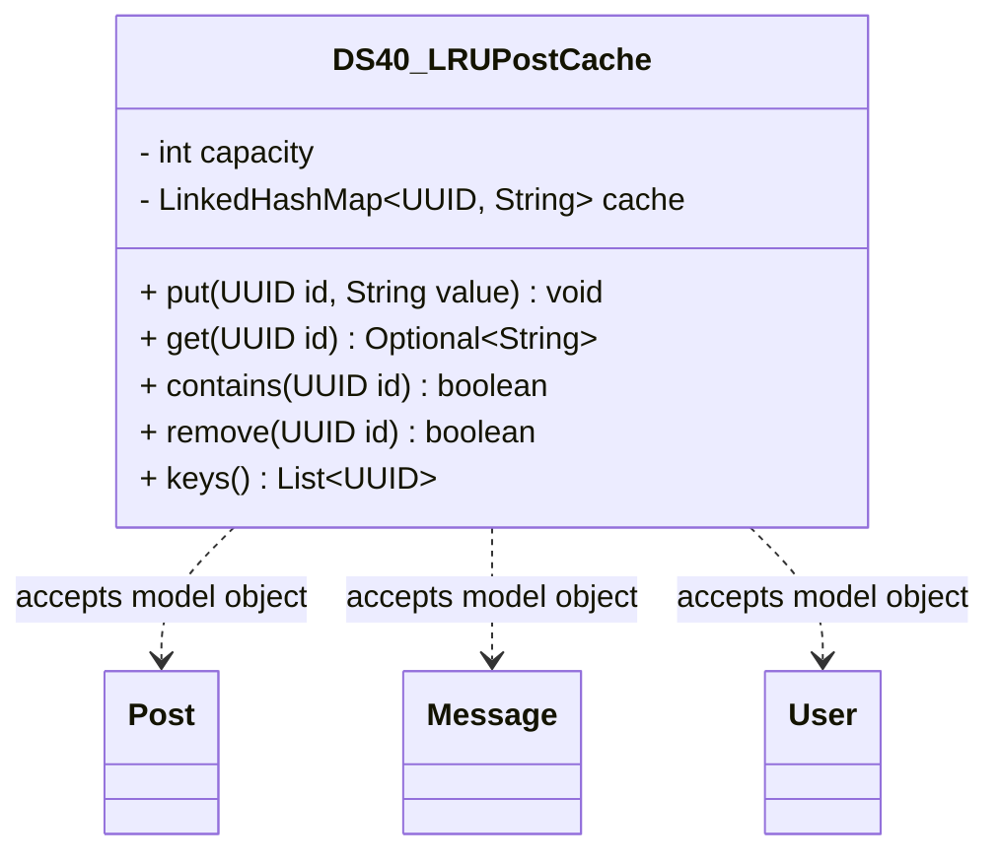

# DS40_LRUPostCache.java

## Explanation

DS40_LRUPostCache is a Mock_hackathon practice implementation for DS40: LRU post cache. It is stored separately from the original MiniLab packages so it can be studied as an extension-style hackathon task without changing the base codebase.

The feature is: Cache recently viewed posts. The task is: LinkedHashMap or deque plus map.

This implementation imports dao.model.Post, dao.model.Message, and dao.model.User where relevant so the practice task can accept real MiniLab domain objects while still preserving a stable UUID/String API for isolated testing.

The class stores a bounded access-order LinkedHashMap so the least-recently-used entry is evicted when capacity is exceeded.

Important edge cases are handled directly in code and tests: empty input, duplicate data, missing records, replacement or removal behavior, and invalid keys where relevant. This makes the class suitable for a mini project hackathon because it demonstrates the core behavior clearly while remaining small enough to modify under time pressure.

A Test Case block is attached to this implementation topic with JUnit 4 coverage for the DS40 catalogue behavior.

## Complexity

Software Architecture and UML Description:

DS40_LRUPostCache is a Mock_hackathon practice extension that sits beside the DAO/model layer. It imports dao.model.Post, dao.model.Message, and dao.model.User so callers can pass real MiniLab domain objects, while the implementation stores independent ids, tokens, scores, queues, ranges, or graph links internally.

In UML, draw dashed dependency arrows from this class to Post, Message, and User because it reads their public fields or record accessors but does not own their lifecycle. Internal maps, queues, nodes, and helper entries are implementation details owned by this class; show them with composition only if the diagram expands the data structure internals.

PlantUML guidance:
DS40_LRUPostCache ..> Post : reads post id/topic
DS40_LRUPostCache ..> Message : reads message id/text/timestamp
DS40_LRUPostCache ..> User : reads user id/username

## UML



## Code
```java
package hackathon;

import dao.model.Message;
import dao.model.Post;
import dao.model.User;
import java.util.ArrayList;
import java.util.Iterator;
import java.util.LinkedHashMap;
import java.util.List;
import java.util.Objects;
import java.util.Optional;
import java.util.UUID;

/**
 * DS40 practice implementation for lRU post cache.
 */
public class DS40_LRUPostCache {
    private final int capacity;
    private final LinkedHashMap<UUID, String> cache;

    // Creates a cache with default capacity.
    public DS40_LRUPostCache() {
        this(3);
    }

    // Creates a cache with a fixed positive capacity.
    public DS40_LRUPostCache(int capacity) {
        if (capacity <= 0) {
            throw new IllegalArgumentException("capacity must be positive");
        }
        this.capacity = capacity;
        this.cache = new LinkedHashMap<>(16, 0.75f, true);
    }

    // Saves a value and evicts the oldest entry when full.
    public void put(UUID id, String value) {
        cache.put(Objects.requireNonNull(id, "id"), String.valueOf(value));
        while (cache.size() > capacity) {
            Iterator<UUID> iterator = cache.keySet().iterator();
            iterator.next();
            iterator.remove();
        }
    }

    // Returns a cached value and refreshes recency.
    public Optional<String> get(UUID id) {
        return Optional.ofNullable(cache.get(id));
    }

    // Checks whether the cache contains an id.
    public boolean contains(UUID id) {
        return cache.containsKey(id);
    }

    // Removes a cached id.
    public boolean remove(UUID id) {
        return cache.remove(id) != null;
    }

    // Returns ids from least to most recently used.
    public List<UUID> keys() {
        return new ArrayList<>(cache.keySet());
    }

    // Returns the number of cached values.
    public int size() {
        return cache.size();
    }
    // Stores a MiniLab Post topic in the cache.
    public void putPost(Post post) {
        if (post != null) {
            put(post.id, post.topic);
        }
    }

    // Stores a MiniLab Message body in the cache.
    public void putMessage(Message message) {
        if (message != null) {
            put(message.id(), message.message());
        }
    }

    // Stores a MiniLab User username in the cache.
    public void putUser(User user) {
        if (user != null) {
            put(user.id(), user.username());
        }
    }


}

```
