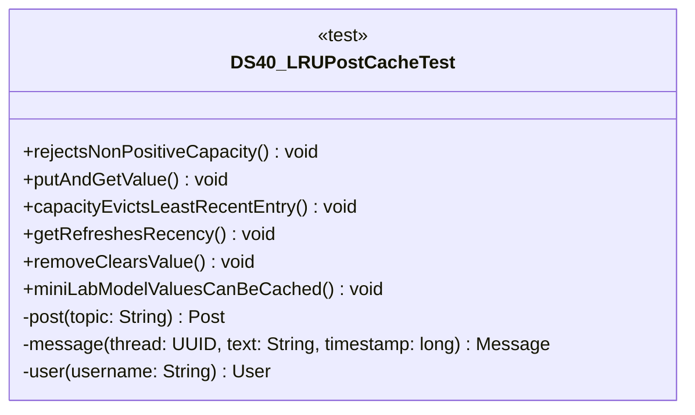

# DS40_LRUPostCacheTest.java

## Explanation

This test file defines the DS40_LRUPostCacheTest class in the hackathon package. It belongs to test/Mock_hackathon/DataStructures in the COMP2100 MiniLab codebase and verifies behavior of the ds40 lru post cache implementation. It uses JUnit 4 style testing through org.junit imports. Key methods include rejectsNonPositiveCapacity, putAndGetValue, capacityEvictsLeastRecentEntry, getRefreshesRecency, removeClearsValue.

## Complexity

Test complexity depends on the tested scenario and input size; most unit tests use small fixed-size inputs.

## UML



## Code
```java
package hackathon;

import dao.model.Message;
import dao.model.Post;
import dao.model.User;
import java.util.UUID;
import org.junit.Test;
import static org.junit.Assert.*;

/**
 * Tests DS40: LRU post cache.
 */
public class DS40_LRUPostCacheTest {
    // Verifies that cache capacity must be positive.
    @Test(expected = IllegalArgumentException.class)
    public void rejectsNonPositiveCapacity() {
        new DS40_LRUPostCache(0);
    }

    // Verifies that saved values can be read.
    @Test
    public void putAndGetValue() {
        DS40_LRUPostCache cache = new DS40_LRUPostCache(2);
        UUID id = UUID.randomUUID();
        cache.put(id, "draft");
        assertEquals("draft", cache.get(id).get());
    }

    // Verifies that old entries are evicted when full.
    @Test
    public void capacityEvictsLeastRecentEntry() {
        DS40_LRUPostCache cache = new DS40_LRUPostCache(1);
        UUID oldId = UUID.randomUUID();
        UUID newId = UUID.randomUUID();
        cache.put(oldId, "old");
        cache.put(newId, "new");
        assertFalse(cache.contains(oldId));
        assertTrue(cache.contains(newId));
    }

    // Verifies that reading updates recency.
    @Test
    public void getRefreshesRecency() {
        DS40_LRUPostCache cache = new DS40_LRUPostCache(2);
        UUID first = UUID.randomUUID();
        UUID second = UUID.randomUUID();
        UUID third = UUID.randomUUID();
        cache.put(first, "first");
        cache.put(second, "second");
        cache.get(first);
        cache.put(third, "third");
        assertTrue(cache.contains(first));
        assertFalse(cache.contains(second));
    }

    // Verifies that removing a value updates size.
    @Test
    public void removeClearsValue() {
        DS40_LRUPostCache cache = new DS40_LRUPostCache(2);
        UUID id = UUID.randomUUID();
        cache.put(id, "value");
        assertTrue(cache.remove(id));
        assertEquals(0, cache.size());
    }
    // Verifies MiniLab model values can be cached.
    @Test
    public void miniLabModelValuesCanBeCached() {
        DS40_LRUPostCache cache = new DS40_LRUPostCache(3);
        Post post = post("cached post");
        Message message = message(post.id, "cached reply", 5L);
        User user = user("cacheduser");
        cache.putPost(post);
        cache.putMessage(message);
        cache.putUser(user);
        assertTrue(cache.contains(post.id));
        assertTrue(cache.contains(message.id()));
        assertTrue(cache.contains(user.id()));
    }

    // Creates a MiniLab Post for integration tests.
    private Post post(String topic) {
        return new Post(UUID.randomUUID(), UUID.randomUUID(), topic);
    }

    // Creates a MiniLab Message for integration tests.
    private Message message(UUID thread, String text, long timestamp) {
        return new Message(UUID.randomUUID(), UUID.randomUUID(), thread, timestamp, text);
    }

    // Creates a MiniLab User for integration tests.
    private User user(String username) {
        return new User(UUID.randomUUID(), User.Role.Member, username, "password");
    }


}

```
