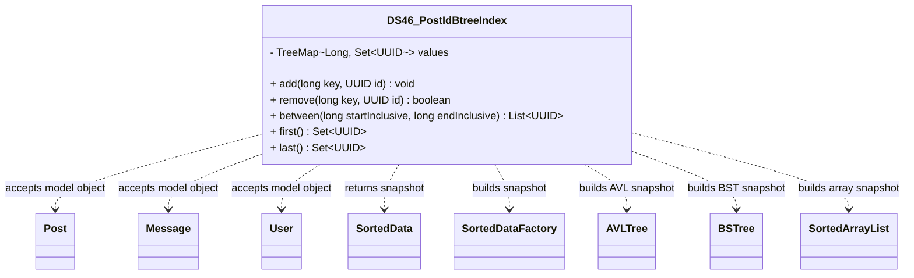

# DS46_PostIdBtreeIndex.java

## Explanation

DS46_PostIdBtreeIndex is a Mock_hackathon practice implementation for DS46: Post id B-tree index. It is stored separately from the original MiniLab packages so it can be studied as an extension-style hackathon task without changing the base codebase.

The feature is: Search many posts by id with disk-friendly structure. The task is: Simplified B-tree with multi-key nodes.

This implementation imports dao.model.Post, dao.model.Message, and dao.model.User where relevant so the practice task can accept real MiniLab domain objects while still preserving a stable UUID/String API for isolated testing. It also imports SortedData, SortedDataFactory, AVLTree, BSTree, and SortedArrayList so range-style tasks can expose snapshots that align with the original sorteddata layer.

The class stores ids inside a TreeMap keyed by long values so inclusive range queries and first/last bucket lookups are efficient.

Important edge cases are handled directly in code and tests: empty input, duplicate data, missing records, replacement or removal behavior, and invalid keys where relevant. This makes the class suitable for a mini project hackathon because it demonstrates the core behavior clearly while remaining small enough to modify under time pressure.

A Test Case block is attached to this implementation topic with JUnit 4 coverage for the DS46 catalogue behavior.

## Complexity

Software Architecture and UML Description:

DS46_PostIdBtreeIndex is a Mock_hackathon practice extension that sits beside the DAO/model layer. It imports dao.model.Post, dao.model.Message, and dao.model.User so callers can pass real MiniLab domain objects, while the implementation stores independent ids, tokens, scores, queues, ranges, or graph links internally.

In UML, draw dashed dependency arrows from this class to Post, Message, and User because it reads their public fields or record accessors but does not own their lifecycle. Internal maps, queues, nodes, and helper entries are implementation details owned by this class; show them with composition only if the diagram expands the data structure internals.

PlantUML guidance:
DS46_PostIdBtreeIndex ..> Post : reads post id/topic
DS46_PostIdBtreeIndex ..> Message : reads message id/text/timestamp
DS46_PostIdBtreeIndex ..> User : reads user id/username
DS46_PostIdBtreeIndex ..> SortedData : returns snapshot
DS46_PostIdBtreeIndex ..> SortedDataFactory : builds factory-backed snapshot
DS46_PostIdBtreeIndex ..> AVLTree : exposes AVL snapshot
DS46_PostIdBtreeIndex ..> BSTree : exposes BST snapshot
DS46_PostIdBtreeIndex ..> SortedArrayList : exposes array snapshot

## UML



## Code
```java
package hackathon;

import dao.model.Message;
import dao.model.Post;
import dao.model.User;
import java.util.ArrayList;
import java.util.Collections;
import java.util.LinkedHashSet;
import java.util.List;
import java.util.Objects;
import java.util.Set;
import java.util.TreeMap;
import java.util.UUID;
import sorteddata.avltree.AVLTree;
import sorteddata.bstree.BSTree;
import sorteddata.sortedarraylist.SortedArrayList;
import sorteddata.SortedData;
import sorteddata.SortedDataFactory;

/**
 * DS46 practice implementation for post id B-tree index.
 */
public class DS46_PostIdBtreeIndex {
    private final TreeMap<Long, Set<UUID>> values = new TreeMap<>();

    // Creates an empty range index.
    public DS46_PostIdBtreeIndex() {
    }

    // Adds an id under a sortable key.
    public void add(long key, UUID id) {
        Objects.requireNonNull(id, "id");
        values.computeIfAbsent(key, ignored -> new LinkedHashSet<>()).add(id);
    }

    // Removes an id from a sortable key.
    public boolean remove(long key, UUID id) {
        Set<UUID> bucket = values.get(key);
        if (bucket == null || !bucket.remove(id)) {
            return false;
        }
        if (bucket.isEmpty()) {
            values.remove(key);
        }
        return true;
    }

    // Returns ids whose keys are inside the inclusive range.
    public List<UUID> between(long startInclusive, long endInclusive) {
        List<UUID> result = new ArrayList<>();
        for (Set<UUID> bucket : values.subMap(startInclusive, true, endInclusive, true).values()) {
            result.addAll(bucket);
        }
        return result;
    }

    // Returns ids at the smallest key.
    public Set<UUID> first() {
        return values.isEmpty() ? Collections.emptySet() : new LinkedHashSet<>(values.firstEntry().getValue());
    }

    // Returns ids at the largest key.
    public Set<UUID> last() {
        return values.isEmpty() ? Collections.emptySet() : new LinkedHashSet<>(values.lastEntry().getValue());
    }

    // Counts all ids in the range index.
    public int count() {
        int count = 0;
        for (Set<UUID> bucket : values.values()) {
            count += bucket.size();
        }
        return count;
    }
    // Adds a MiniLab Post under a supplied sortable key.
    public void addPost(Post post, long key) {
        if (post != null) {
            add(key, post.id);
        }
    }

    // Adds a MiniLab Message using its timestamp as the key.
    public void addMessage(Message message) {
        if (message != null) {
            add(message.timestamp(), message.id());
        }
    }

    // Adds a MiniLab User under a supplied sortable key.
    public void addUser(User user, long key) {
        if (user != null) {
            add(key, user.id());
        }
    }

    // Builds a SortedData snapshot using the original MiniLab factory.
    public SortedData<UUID> sortedSnapshot() {
        SortedData<UUID> snapshot = SortedDataFactory.makeSortedData(UUID::compareTo);
        for (UUID id : allIds()) {
            snapshot.insert(id);
        }
        return snapshot;
    }

    // Builds an AVLTree snapshot for diagramming AVL-backed indexes.
    public AVLTree<UUID> avlSnapshot() {
        AVLTree<UUID> snapshot = new AVLTree<>(UUID::compareTo);
        for (UUID id : allIds()) {
            snapshot.insert(id);
        }
        return snapshot;
    }

    // Builds a BSTree snapshot for comparing tree-backed indexes.
    public BSTree<UUID> bstSnapshot() {
        BSTree<UUID> snapshot = new BSTree<>(UUID::compareTo);
        for (UUID id : allIds()) {
            snapshot.insert(id);
        }
        return snapshot;
    }

    // Builds a SortedArrayList snapshot for array-backed indexes.
    public SortedArrayList<UUID> sortedArraySnapshot() {
        SortedArrayList<UUID> snapshot = new SortedArrayList<>(UUID::compareTo);
        for (UUID id : allIds()) {
            snapshot.insert(id);
        }
        return snapshot;
    }

    // Collects all ids in key order.
    private List<UUID> allIds() {
        List<UUID> ids = new ArrayList<>();
        for (Set<UUID> bucket : values.values()) {
            ids.addAll(bucket);
        }
        return ids;
    }


}

```
