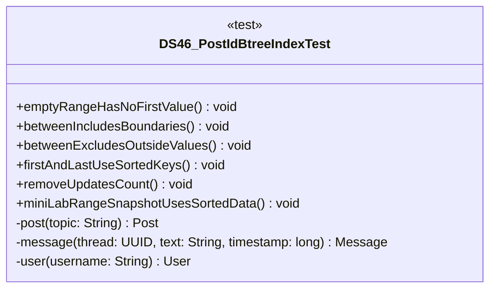

# DS46_PostIdBtreeIndexTest.java

## Explanation

This test file defines the DS46_PostIdBtreeIndexTest class in the hackathon package. It belongs to test/Mock_hackathon/DataStructures in the COMP2100 MiniLab codebase and verifies behavior of the ds46 post id btree index implementation. It uses JUnit 4 style testing through org.junit imports. Key methods include emptyRangeHasNoFirstValue, betweenIncludesBoundaries, betweenExcludesOutsideValues, firstAndLastUseSortedKeys, removeUpdatesCount.

## Complexity

Test complexity depends on the tested scenario and input size; most unit tests use small fixed-size inputs.

## UML



## Code
```java
package hackathon;

import dao.model.Message;
import dao.model.Post;
import dao.model.User;
import java.util.Arrays;
import java.util.Collections;
import java.util.UUID;
import org.junit.Test;
import static org.junit.Assert.*;

/**
 * Tests DS46: Post id B-tree index.
 */
public class DS46_PostIdBtreeIndexTest {
    // Verifies that an empty range has no first value.
    @Test
    public void emptyRangeHasNoFirstValue() {
        DS46_PostIdBtreeIndex range = new DS46_PostIdBtreeIndex();
        assertTrue(range.first().isEmpty());
        assertEquals(0, range.count());
    }

    // Verifies that range lookup includes both boundaries.
    @Test
    public void betweenIncludesBoundaries() {
        DS46_PostIdBtreeIndex range = new DS46_PostIdBtreeIndex();
        UUID low = UUID.randomUUID();
        UUID high = UUID.randomUUID();
        range.add(10, low);
        range.add(20, high);
        assertEquals(Arrays.asList(low, high), range.between(10, 20));
    }

    // Verifies that values outside the range are excluded.
    @Test
    public void betweenExcludesOutsideValues() {
        DS46_PostIdBtreeIndex range = new DS46_PostIdBtreeIndex();
        UUID inside = UUID.randomUUID();
        UUID outside = UUID.randomUUID();
        range.add(5, outside);
        range.add(15, inside);
        assertEquals(Collections.singletonList(inside), range.between(10, 20));
    }

    // Verifies first and last buckets.
    @Test
    public void firstAndLastUseSortedKeys() {
        DS46_PostIdBtreeIndex range = new DS46_PostIdBtreeIndex();
        UUID first = UUID.randomUUID();
        UUID last = UUID.randomUUID();
        range.add(2, last);
        range.add(1, first);
        assertTrue(range.first().contains(first));
        assertTrue(range.last().contains(last));
    }

    // Verifies that removing an id updates the count.
    @Test
    public void removeUpdatesCount() {
        DS46_PostIdBtreeIndex range = new DS46_PostIdBtreeIndex();
        UUID id = UUID.randomUUID();
        range.add(1, id);
        assertTrue(range.remove(1, id));
        assertEquals(0, range.count());
    }
    // Verifies MiniLab timestamps and sorteddata snapshots work together.
    @Test
    public void miniLabRangeSnapshotUsesSortedData() {
        DS46_PostIdBtreeIndex range = new DS46_PostIdBtreeIndex();
        Post post = post("timestamped");
        Message message = message(post.id, "reply", 20L);
        range.addPost(post, 10L);
        range.addMessage(message);
        assertTrue(range.between(0L, 15L).contains(post.id));
        assertNotNull(range.sortedSnapshot().getAll());
        assertNotNull(range.avlSnapshot());
        assertNotNull(range.bstSnapshot());
        assertNotNull(range.sortedArraySnapshot());
    }

    // Creates a MiniLab Post for integration tests.
    private Post post(String topic) {
        return new Post(UUID.randomUUID(), UUID.randomUUID(), topic);
    }

    // Creates a MiniLab Message for integration tests.
    private Message message(UUID thread, String text, long timestamp) {
        return new Message(UUID.randomUUID(), UUID.randomUUID(), thread, timestamp, text);
    }

    // Creates a MiniLab User for integration tests.
    private User user(String username) {
        return new User(UUID.randomUUID(), User.Role.Member, username, "password");
    }


}

```
