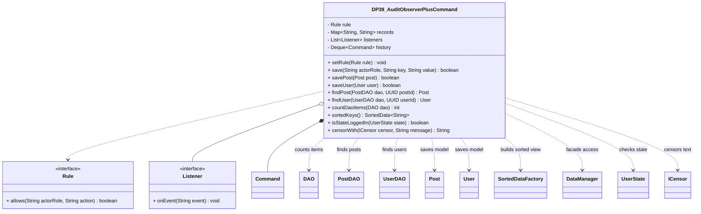

# DP39_AuditObserverPlusCommand.java

## Explanation

DP39_AuditObserverPlusCommand is a Mock_hackathon practice implementation for DP39: Audit observer plus command. It is stored separately from the original MiniLab packages so it can be studied as an extension-style hackathon task without changing the base codebase.

The feature is: Every command execution emits an audit event. The task is: Combine Command and Observer for audit logging.

This implementation imports original MiniLab DAO, model, sorteddata, persistentdata, userstate, and censor abstractions so the pattern can be practiced as a service/facade/repository-style extension over real Post, User, DAO, SortedDataFactory, DataManager, UserState, and ICensor types.

The class acts as a compact pattern-oriented service. It combines a replaceable rule strategy, listener callbacks, command-style undo records, and a small facade-like public API so the design pattern idea is visible through behavior rather than comments alone.

Important edge cases are handled directly in code and tests: empty input, duplicate data, missing records, replacement or removal behavior, and invalid keys where relevant. This makes the class suitable for a mini project hackathon because it demonstrates the core behavior clearly while remaining small enough to modify under time pressure.

A Test Case block is attached to this implementation topic with JUnit 4 coverage for the DP39 catalogue behavior.

## Complexity

Software Architecture and UML Description:

DP39_AuditObserverPlusCommand is a design-pattern practice service that sits above the DAO, userstate, sorteddata, persistentdata, and censor layers. It imports DAO, PostDAO, UserDAO, HasUUID, Post, User, SortedData, SortedDataFactory, DataManager, UserState, and ICensor so the pattern can be applied around real MiniLab abstractions rather than a disconnected example.

In UML, draw dashed dependency arrows to DAO, PostDAO, UserDAO, Post, User, SortedDataFactory, DataManager, UserState, and ICensor because this service uses those abstractions without owning their lifecycle. Draw composition from the service to its internal Command history if showing undo internals, aggregation to Listener when observers are registered, and realization arrows for the Rule and Listener interfaces.

PlantUML guidance:
DP39_AuditObserverPlusCommand ..> DAO : counts DAO items
DP39_AuditObserverPlusCommand ..> PostDAO : finds posts
DP39_AuditObserverPlusCommand ..> UserDAO : finds users
DP39_AuditObserverPlusCommand ..> SortedDataFactory : builds sorted key view
DP39_AuditObserverPlusCommand ..> DataManager : facade access
DP39_AuditObserverPlusCommand ..> UserState : checks state
DP39_AuditObserverPlusCommand ..> ICensor : applies moderation interface

## UML



## Code
```java
package hackathon;

import censor.ICensor;
import dao.DAO;
import dao.model.HasUUID;
import dao.model.Post;
import dao.model.User;
import dao.PostDAO;
import dao.UserDAO;
import java.util.ArrayDeque;
import java.util.ArrayList;
import java.util.Deque;
import java.util.Iterator;
import java.util.LinkedHashMap;
import java.util.List;
import java.util.Map;
import java.util.Objects;
import java.util.Optional;
import java.util.UUID;
import persistentdata.DataManager;
import sorteddata.SortedData;
import sorteddata.SortedDataFactory;
import userstate.UserState;

/**
 * DP39 practice implementation for audit observer plus command.
 */
public class DP39_AuditObserverPlusCommand {
    private Rule rule = (actorRole, action) -> true;
    private final Map<String, String> records = new LinkedHashMap<>();
    private final List<Listener> listeners = new ArrayList<>();
    private final Deque<Command> history = new ArrayDeque<>();

    // Creates an empty pattern practice service.
    public DP39_AuditObserverPlusCommand() {
    }

    // Replaces the permission or strategy rule.
    public void setRule(Rule rule) {
        this.rule = Objects.requireNonNull(rule, "rule");
    }

    // Saves a value when the current rule allows it.
    public boolean save(String actorRole, String key, String value) {
        requireKey(key);
        if (!rule.allows(actorRole, "save")) {
            emit("save denied:" + key);
            return false;
        }
        String oldValue = records.put(key, value == null ? "" : value);
        history.push(new Command(key, oldValue));
        emit("saved:" + key);
        return true;
    }

    // Returns a stored value by key.
    public Optional<String> find(String key) {
        return Optional.ofNullable(records.get(key));
    }

    // Deletes a value when the current rule allows it.
    public boolean delete(String actorRole, String key) {
        requireKey(key);
        if (!rule.allows(actorRole, "delete") || !records.containsKey(key)) {
            emit("delete denied:" + key);
            return false;
        }
        String oldValue = records.remove(key);
        history.push(new Command(key, oldValue));
        emit("deleted:" + key);
        return true;
    }

    // Registers a listener for service events.
    public void addListener(Listener listener) {
        listeners.add(Objects.requireNonNull(listener, "listener"));
    }

    // Undoes the latest saved command.
    public boolean undoLast() {
        if (history.isEmpty()) {
            return false;
        }
        history.pop().undo(records);
        emit("undo");
        return true;
    }

    // Returns stored keys in insertion order.
    public List<String> keys() {
        return new ArrayList<>(records.keySet());
    }

    // Returns the number of stored records.
    public int size() {
        return records.size();
    }

    // Sends an event to registered listeners.
    private void emit(String event) {
        for (Listener listener : listeners) {
            listener.onEvent(event);
        }
    }

    // Rejects blank keys before service work.
    private void requireKey(String key) {
        if (key == null || key.isBlank()) {
            throw new IllegalArgumentException("key is required");
        }
    }

    public interface Rule {
        // Checks whether an actor can perform an action.
        boolean allows(String actorRole, String action);
    }

    public interface Listener {
        // Receives a service event message.
        void onEvent(String event);
    }

    private static class Command {
        private final String key;
        private final String oldValue;

        // Captures enough state to undo one mutation.
        private Command(String key, String oldValue) {
            this.key = key;
            this.oldValue = oldValue;
        }

        // Restores the map state before the mutation.
        private void undo(Map<String, String> records) {
            if (oldValue == null) {
                records.remove(key);
            } else {
                records.put(key, oldValue);
            }
        }
    }
    // Saves a MiniLab Post through the facade-style service API.
    public boolean savePost(Post post) {
        return post != null && save("member", post.id.toString(), post.topic);
    }

    // Saves a MiniLab User through the facade-style service API.
    public boolean saveUser(User user) {
        return user != null && save(user.role().name(), user.id().toString(), user.username());
    }

    // Finds a MiniLab Post using the original PostDAO lookup style.
    public Post findPost(PostDAO dao, UUID postId) {
        return dao == null || postId == null ? null : dao.get(new Post(postId));
    }

    // Finds a MiniLab User using the original UserDAO UUID lookup.
    public User findUser(UserDAO dao, UUID userId) {
        return dao == null || userId == null ? null : dao.getByUUID(userId);
    }

    // Counts items exposed by the original DAO abstraction.
    public int countDaoItems(DAO<? extends HasUUID> dao) {
        if (dao == null) {
            return 0;
        }
        int count = 0;
        Iterator<? extends HasUUID> iterator = dao.getAll();
        while (iterator.hasNext()) {
            iterator.next();
            count++;
        }
        return count;
    }

    // Builds a SortedData snapshot of stored keys using the original factory.
    public SortedData<String> sortedKeys() {
        SortedData<String> sorted = SortedDataFactory.makeSortedData(String::compareTo);
        for (String key : records.keySet()) {
            sorted.insert(key);
        }
        return sorted;
    }

    // Returns the original MiniLab DataManager singleton for facade integration.
    public DataManager dataManager() {
        return DataManager.getInstance();
    }

    // Checks login state through the original UserState abstraction.
    public boolean isStateLoggedIn(UserState state) {
        return state != null && state.isLoggedIn();
    }

    // Applies the original censor interface before storing or displaying text.
    public String censorWith(ICensor censor, String message) {
        return censor == null ? message : censor.censorMessage(message);
    }


}

```
