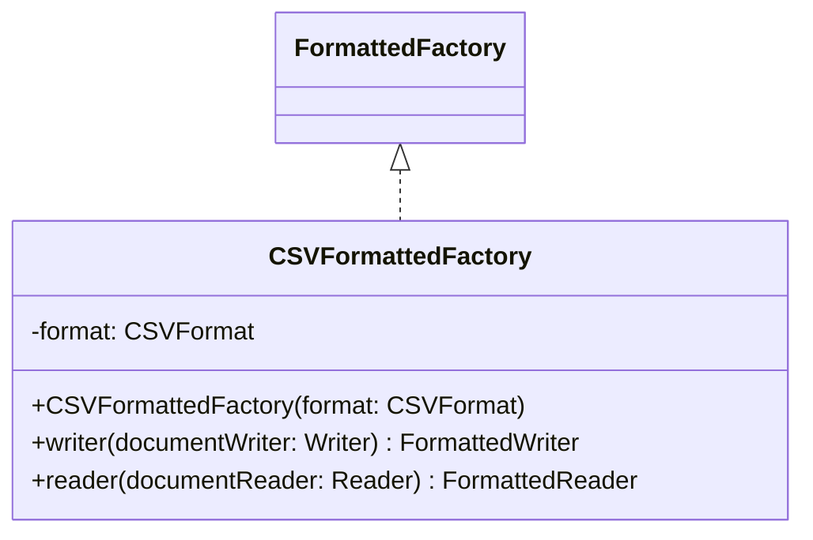

# CSVFormattedFactory.java

## Explanation

This file defines the CSVFormattedFactory class in the persistentdata.formatted package. It belongs to src/persistentdata/formatted in the COMP2100 MiniLab codebase and handles formatted file input or output for persistent data. Key methods include writer, reader.

## Complexity

Reading is typically O(n) in the size of the input file.

## UML



## Code
```java
package persistentdata.formatted;

import java.io.Reader;
import java.io.Writer;

public class CSVFormattedFactory implements FormattedFactory<String[]> {
	private final CSVFormat format;

	public CSVFormattedFactory(CSVFormat format) {
		this.format = format;
	}

	@Override
	public FormattedWriter<String[]> writer(Writer documentWriter) {
		return new CSVWriter(format, documentWriter);
	}

	@Override
	public FormattedReader<String[]> reader(Reader documentReader) {
		return new CSVReader(format, documentReader);
	}
}

```
