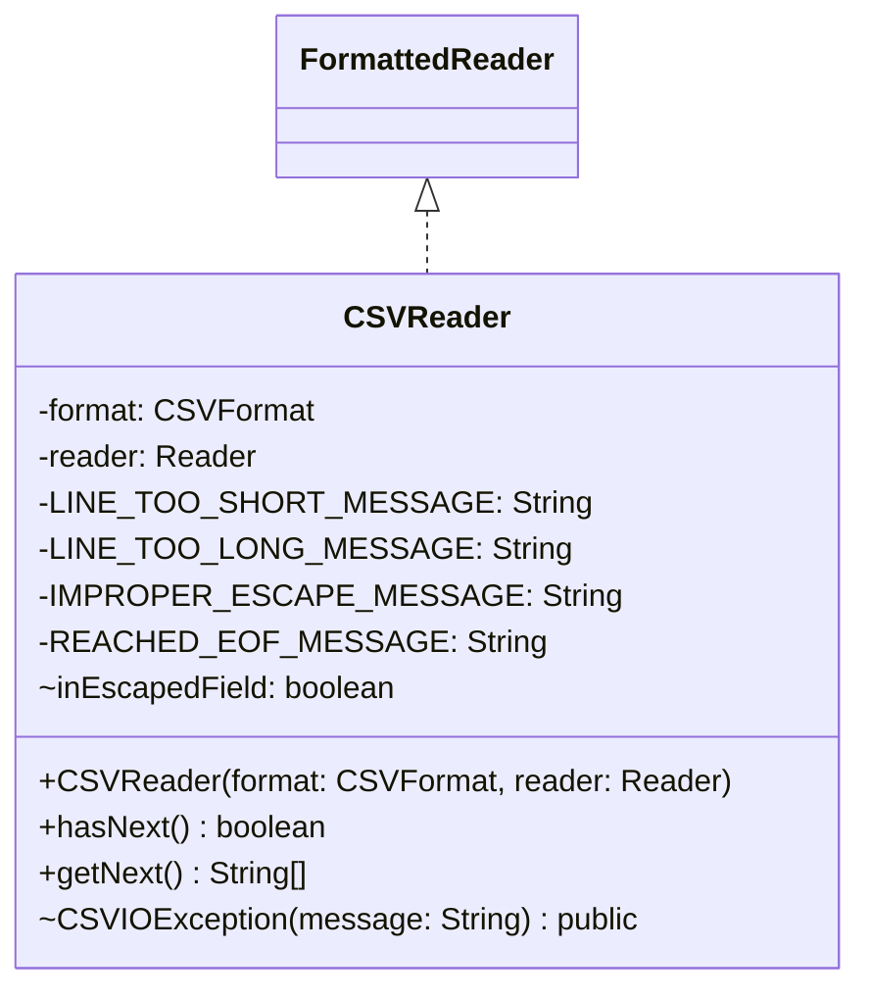

# CSVReader.java

## Explanation

This file defines the CSVReader class in the persistentdata.formatted package. It belongs to src/persistentdata/formatted in the COMP2100 MiniLab codebase and handles formatted file input or output for persistent data. Key methods include hasNext, getNext, CSVIOException.

## Complexity

Reading is typically O(n) in the size of the input file.

## UML



## Code
```java
package persistentdata.formatted;

import persistentdata.PersistentDataException;

import java.io.IOException;
import java.io.Reader;
import java.util.ArrayList;
import java.util.List;

public class CSVReader implements FormattedReader<String[]> {
	private final CSVFormat format;
	private final Reader reader;

	public CSVReader(CSVFormat format, Reader reader) {
		this.format = format;
		this.reader = reader;
	}

	public boolean hasNext() {
		// TODO: Complete this method according to the CSV specification, without using dedicated libraries
		try {
			reader.mark(1);
			int next = reader.read();
			if (next == -1) return false;
			reader.reset();
			return true;
		} catch (IOException e) {
			throw new CSVIOException(e.getMessage());
		}
	}

	// These format strings are provided to give you some ideas about what error cases might be encountered,
	// but they aren't complete. If you haven't seen these before, you can fill in the %s with .formatted:
	// for example, "hello %s".formatted("Bernardo") returns "hello Bernardo"
	private static final String LINE_TOO_SHORT_MESSAGE = "Line was too short: expected %s fields but found %s";
	private static final String LINE_TOO_LONG_MESSAGE = "Line was too long: expected %s fields";
	private static final String IMPROPER_ESCAPE_MESSAGE = "EOF reached unexpectedly while escaped";
	private static final String REACHED_EOF_MESSAGE = "Already reached end of file while reading";

	public String[] getNext() {
		// TODO: Complete this method according to the CSV specification, without using dedicated libraries
		if (!hasNext()) {
			throw new CSVIOException(REACHED_EOF_MESSAGE);
		}

		try {
			List<String> fields = new ArrayList<>();
			StringBuilder current = new StringBuilder();
			boolean inEscapedField = false;

			while (true) {
				int raw = reader.read();

				if (raw == -1) {
					if (inEscapedField) {
						throw new CSVIOException(IMPROPER_ESCAPE_MESSAGE);
					}
					fields.add(current.toString());
					break;
				}

				char c = (char) raw;

				if (inEscapedField) {
					if (c == format.ESCAPE_MARKER) {
						reader.mark(1);
						int nextRaw = reader.read();
						if (nextRaw == format.ESCAPE_MARKER) {
							current.append(format.ESCAPE_MARKER);
						} else {
							inEscapedField = false;
							if (nextRaw != -1) reader.reset();
						}
					} else {
						current.append(c);
					}
				} else {
					if (c == format.ESCAPE_MARKER) {
						inEscapedField = true;
					} else if (c == format.FIELD_SEPARATOR) {
						fields.add(current.toString());
						current.setLength(0);
					} else if (c == format.LINE_SEPARATOR) {
						fields.add(current.toString());
						break;
					} else {
						current.append(c);
					}
				}
			}

			if (fields.size() < format.COLUMN_COUNT) {
				throw new CSVIOException(LINE_TOO_SHORT_MESSAGE.formatted(format.COLUMN_COUNT, fields.size()));
			}
			if (fields.size() > format.COLUMN_COUNT) {
				throw new CSVIOException(LINE_TOO_LONG_MESSAGE.formatted(format.COLUMN_COUNT));
			}

			return fields.toArray(new String[0]);
		} catch (IOException e) {
			throw new CSVIOException(e.getMessage());
		}
	}

	public static class CSVIOException extends PersistentDataException {
		public CSVIOException(String message) {
			super(message);
		}
	}
}

```
