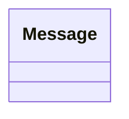

# Message.java

## Explanation

This file defines the Message record in the dao.model package. It belongs to src/dao/model in the COMP2100 MiniLab codebase and separates data access responsibilities from application logic.

## Complexity

DAO operation complexity depends on the backing storage. In-memory lookups may be O(1) with maps or O(n) with lists; file-backed operations may require O(n) scanning or serialization.

## UML



## Code
```java
package dao.model;

import java.util.UUID;

public record Message(UUID id, UUID poster, UUID thread, long timestamp, String message) {}
```
