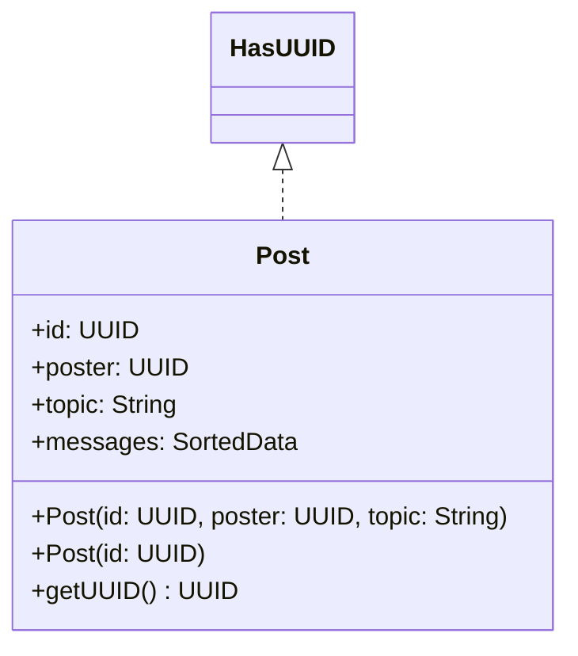

# Post.java

## Explanation

This file defines the Post class in the dao.model package. It belongs to src/dao/model in the COMP2100 MiniLab codebase and separates data access responsibilities from application logic. Key methods include getUUID.

## Complexity

DAO operation complexity depends on the backing storage. In-memory lookups may be O(1) with maps or O(n) with lists; file-backed operations may require O(n) scanning or serialization.

## UML



## Code
```java
package dao.model;

import dao.MessageComparator;
import sorteddata.SortedData;
import sorteddata.SortedDataFactory;

import java.util.UUID;

public class Post implements HasUUID {
	public final UUID id;
	public final UUID poster;
	public final String topic;
    public final SortedData<Message> messages;

	public Post(UUID id, UUID poster, String topic) {
		this.id = id;
		this.poster = poster;
		this.topic = topic;
		this.messages = SortedDataFactory.makeSortedData(MessageComparator.getInstance());
	}

	public Post(UUID id) {
		this(id, null, null);
	}

	public UUID getUUID() { return id; }
}

```
