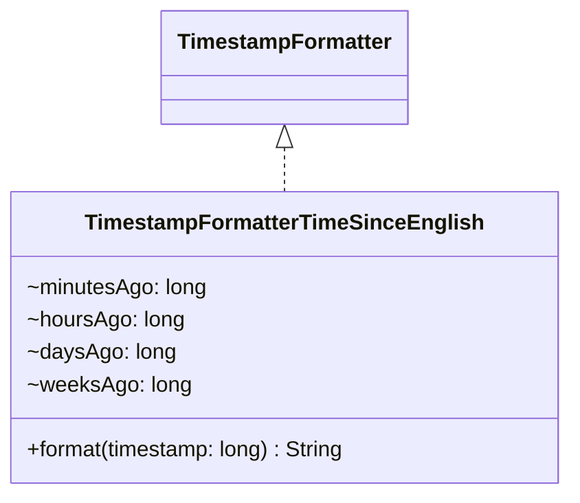

# TimestampFormatterTimeSinceEnglish.java

## Explanation

This file defines the TimestampFormatterTimeSinceEnglish class in the dao.model package. It belongs to src/dao/model in the COMP2100 MiniLab codebase and separates data access responsibilities from application logic. Key methods include format.

## Complexity

DAO operation complexity depends on the backing storage. In-memory lookups may be O(1) with maps or O(n) with lists; file-backed operations may require O(n) scanning or serialization.

## UML



## Code
```java
package dao.model;

public class TimestampFormatterTimeSinceEnglish implements TimestampFormatter {
	/**
	 * Generates a textual label describing how long ago timestamp was,
	 * compared with the current system time
	 * @param timestamp the UNIX time in milliseconds to compare to
	 * @return a String-based timestamp descriptor
	 */
	@Override
	public String format(long timestamp) {
		long current = System.currentTimeMillis();
		if (timestamp > current) return "in the future";

		long secondsAgo = (current - timestamp)/1000;
		if (secondsAgo < 5) return "right now";
		else if (secondsAgo < 60) return "%s seconds ago".formatted(secondsAgo);

		long minutesAgo = secondsAgo / 60;
		if (minutesAgo == 1) return "a minute ago";
		if (minutesAgo < 60) return "%s minutes ago".formatted(minutesAgo);

		long hoursAgo = minutesAgo / 60;
		if (hoursAgo == 1) return "an hour ago";
		if (hoursAgo < 24) return "%s hours ago".formatted(hoursAgo);

		long daysAgo = hoursAgo / 24;
		if (daysAgo == 1) return "a day ago";
		if (daysAgo < 7) return "%s days ago".formatted(daysAgo);

		long weeksAgo = daysAgo / 7;
		if (weeksAgo == 1) return "a week ago";
		if (weeksAgo == 2) return "a fortnight ago";

		return "a while ago";
	}
}

```
