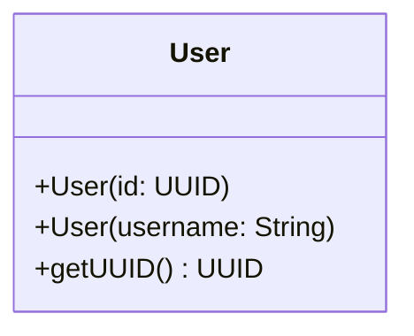

# User.java

## Explanation

This file defines the User record in the dao.model package. It belongs to src/dao/model in the COMP2100 MiniLab codebase and separates data access responsibilities from application logic. Key methods include getUUID.

## Complexity

DAO operation complexity depends on the backing storage. In-memory lookups may be O(1) with maps or O(n) with lists; file-backed operations may require O(n) scanning or serialization.

## UML



## Code
```java
package dao.model;

import java.util.UUID;

public record User(UUID id, Role role, String username, String password) implements HasUUID {
	public enum Role {Member, Admin}

	public UUID getUUID() {
		return id;
	}

	public User(UUID id) {
		this(id, Role.Member, null, null);
	}

	public User(String username) {
		this(null, Role.Member, username, null);
	}
}

```
