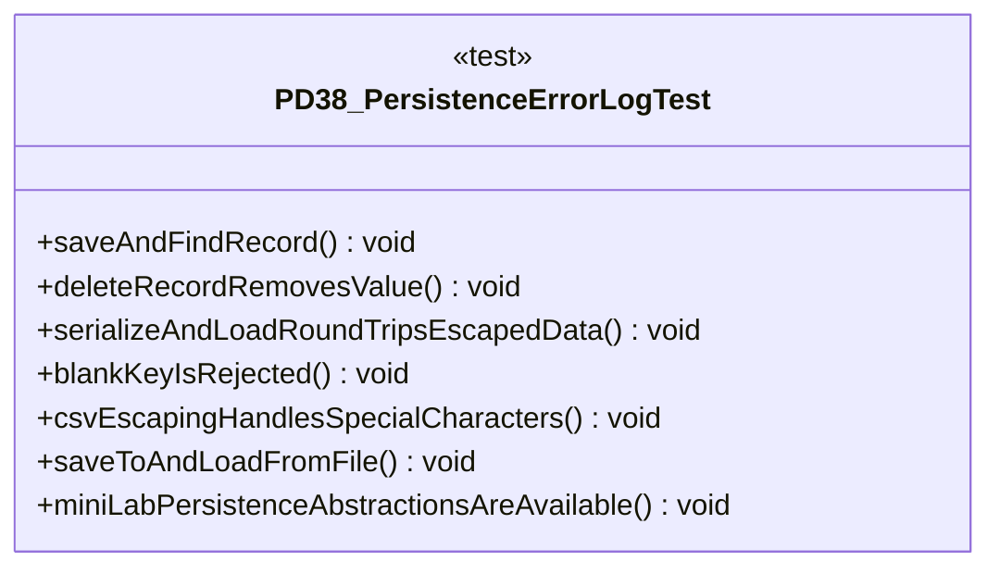

# PD38_PersistenceErrorLogTest.java

## Explanation

This test file defines the PD38_PersistenceErrorLogTest class in the hackathon package. It belongs to test/Mock_hackathon/PersistentData_Mock in the COMP2100 MiniLab codebase and verifies behavior of the pd38 persistence error log implementation. It uses JUnit 4 style testing through org.junit imports. Key methods include saveAndFindRecord, deleteRecordRemovesValue, serializeAndLoadRoundTripsEscapedData, blankKeyIsRejected, csvEscapingHandlesSpecialCharacters.

## Complexity

Test complexity depends on the tested scenario and input size; most unit tests use small fixed-size inputs.

## UML



## Code
```java
package hackathon;

import java.nio.file.Files;
import java.nio.file.Path;
import java.util.Arrays;
import java.util.Collections;
import java.util.List;
import org.junit.Test;
import static org.junit.Assert.*;

/**
 * Tests PD38: Persistence error log.
 */
public class PD38_PersistenceErrorLogTest {
    // Verifies that saved records can be read back.
    @Test
    public void saveAndFindRecord() {
        PD38_PersistenceErrorLog store = new PD38_PersistenceErrorLog();
        store.saveRecord("post-1", "hello");
        assertEquals("hello", store.findRecord("post-1").get());
    }

    // Verifies that deleting records updates size.
    @Test
    public void deleteRecordRemovesValue() {
        PD38_PersistenceErrorLog store = new PD38_PersistenceErrorLog();
        store.saveRecord("post-1", "hello");
        assertTrue(store.deleteRecord("post-1"));
        assertEquals(0, store.size());
    }

    // Verifies that serialization round-trips comma and quote data.
    @Test
    public void serializeAndLoadRoundTripsEscapedData() {
        PD38_PersistenceErrorLog store = new PD38_PersistenceErrorLog();
        store.saveRecord("post-1", "hello, \"MiniLab\"");
        PD38_PersistenceErrorLog loaded = new PD38_PersistenceErrorLog();
        loaded.load(store.serialize());
        assertEquals("hello, \"MiniLab\"", loaded.findRecord("post-1").get());
    }

    // Verifies that blank keys are rejected.
    @Test(expected = IllegalArgumentException.class)
    public void blankKeyIsRejected() {
        PD38_PersistenceErrorLog store = new PD38_PersistenceErrorLog();
        store.saveRecord(" ", "value");
    }

    // Verifies robust CSV escaping for commas quotes and newlines.
    @Test
    public void csvEscapingHandlesSpecialCharacters() {
        PD38_PersistenceErrorLog store = new PD38_PersistenceErrorLog();
        String row = store.encodeRow(Arrays.asList("a,b", "quote \"x\"", "line\nbreak"));
        assertEquals(Arrays.asList("a,b", "quote \"x\"", "line\nbreak"), store.decodeRow(row));
    }

    // Verifies that file save and load use UTF-8 text.
    @Test
    public void saveToAndLoadFromFile() throws Exception {
        Path path = Files.createTempFile("mock-hackathon", ".csv");
        PD38_PersistenceErrorLog store = new PD38_PersistenceErrorLog();
        store.saveRecord("key", "value");
        store.saveTo(path);
        PD38_PersistenceErrorLog loaded = new PD38_PersistenceErrorLog();
        loaded.loadFrom(path);
        assertEquals("value", loaded.findRecord("key").get());
        Files.deleteIfExists(path);
    }
    // Verifies the helper can use original MiniLab persistence abstractions.
    @Test
    public void miniLabPersistenceAbstractionsAreAvailable() {
        PD38_PersistenceErrorLog store = new PD38_PersistenceErrorLog();
        assertNotNull(store.miniLabDataManager());
        assertNotNull(store.csvFactory(2));
        assertNotNull(store.recordSerializer());
        assertNotNull(store.pipeline("mock-hackathon-records"));
        String csv = store.writeCsvRows(Collections.singletonList(new String[] { "key", "value" }), 2);
        List<String[]> rows = store.readCsvRows(csv, 2);
        assertArrayEquals(new String[] { "key", "value" }, rows.get(0));
    }


}

```
