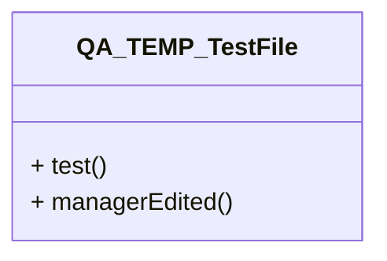

# QA_TEMP_TestFile.java

## Explanation

Temporary QA manager edit explanation.

## Complexity

Manager QA complexity.

## UML



## Code
```java
public class QA_TEMP_TestFile {
    public void test() {
        if (true) {
            System.out.println("manager edit persisted");
        }
    }
}
```
