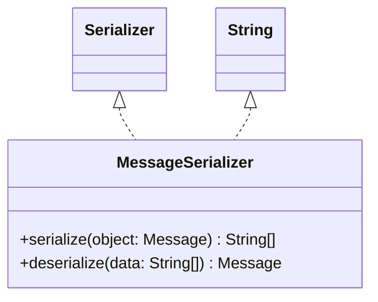

# MessageSerializer.java

## Explanation

This file defines the MessageSerializer class in the persistentdata.serialization package. It belongs to src/persistentdata/serialization in the COMP2100 MiniLab codebase and converts domain objects to and from persistent representations. Key methods include serialize, deserialize.

## Complexity

Complexity depends on the methods used in this class. Review loops, collection operations, and persistence calls for exact bounds.

## UML



## Code
```java
package persistentdata.serialization;

import dao.model.Message;

import java.util.UUID;

/**
 * Converts between Messages and String[] by converting each field of Post
 * (UUID, poster, thread, timestamp, and message) to a string, which becomes one of the entries
 * within the array
 */
public class MessageSerializer implements Serializer<Message, String[]> {

	@Override
	public String[] serialize(Message object) {
		return new String[] {object.id().toString(), object.poster().toString(), object.thread().toString(), String.valueOf(object.timestamp()), object.message()};
	}

	@Override
	public Message deserialize(String[] data) {
		return new Message(UUID.fromString(data[0]), UUID.fromString(data[1]), UUID.fromString(data[2]), Long.valueOf(data[3]), data[4]);
	}
}

```
