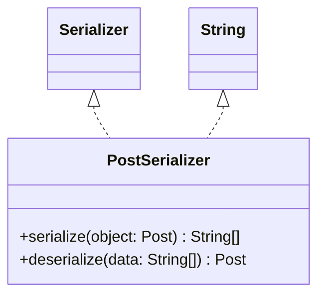

# PostSerializer.java

## Explanation

This file defines the PostSerializer class in the persistentdata.serialization package. It belongs to src/persistentdata/serialization in the COMP2100 MiniLab codebase and converts domain objects to and from persistent representations. Key methods include serialize, deserialize.

## Complexity

Complexity depends on the methods used in this class. Review loops, collection operations, and persistence calls for exact bounds.

## UML



## Code
```java
package persistentdata.serialization;
import dao.model.Post;

import java.util.UUID;

/**
 * Converts between Posts and String[] by converting each field of Post
 * (UUID, poster, and topic) to a string, which becomes one of the entries
 * within the array
 */
public class PostSerializer implements Serializer<Post, String[]> {

	@Override
	public String[] serialize(Post object) {
		return new String[] {object.id.toString(), object.poster.toString(), object.topic};
	}

	@Override
	public Post deserialize(String[] data) {
		return new Post(UUID.fromString(data[0]), UUID.fromString(data[1]), data[2]);
	}
}

```
