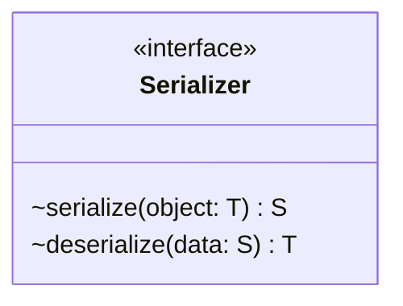

# Serializer.java

## Explanation

This file defines the Serializer interface in the persistentdata.serialization package. It belongs to src/persistentdata/serialization in the COMP2100 MiniLab codebase and converts domain objects to and from persistent representations. Key methods include serialize, deserialize.

## Complexity

Complexity depends on the methods used in this class. Review loops, collection operations, and persistence calls for exact bounds.

## UML



## Code
```java
package persistentdata.serialization;

public interface Serializer<T, S> {
	/**
	 * Convert from the object form used in the program's model
	 * to a more primitive representation managed by the FormattedWriter
	 * @param object the object to serialize
	 * @return the serialized data
	 */
	S serialize(T object);

	/**
	 * Convert from the object received from the FormattedReader
	 * to a more abstract representation that can be managed by the application
	 * @param data the serialized data
	 * @return the corresponding object
	 */
	T deserialize(S data);
}

```
