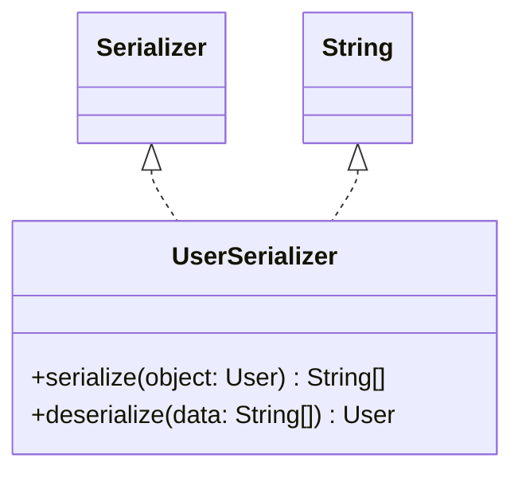

# UserSerializer.java

## Explanation

This file defines the UserSerializer class in the persistentdata.serialization package. It belongs to src/persistentdata/serialization in the COMP2100 MiniLab codebase and converts domain objects to and from persistent representations. Key methods include serialize, deserialize.

## Complexity

Complexity depends on the methods used in this class. Review loops, collection operations, and persistence calls for exact bounds.

## UML



## Code
```java
package persistentdata.serialization;

import dao.model.User;

import java.util.UUID;

/**
 * TODO: Document your schema here
 */
public class UserSerializer implements Serializer<User, String[]> {
	@Override
	public String[] serialize(User object) {
		// TODO: Complete this method according to the schema you have designed
		return new String[] {
				object.id().toString(),
				object.role().name(),
				object.username(),
				object.password()
		};
	}

	@Override
	public User deserialize(String[] data) {
		// TODO: Complete this method according to the schema you have designed
		return new User(
				UUID.fromString(data[0]),
				User.Role.valueOf(data[1]),
				data[2],
				data[3]
		);
	}
}

```
