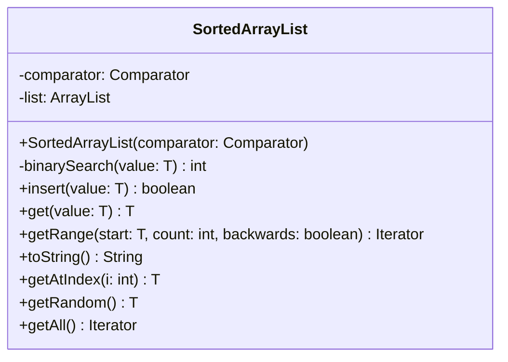

# SortedArrayList.java

## Explanation

This file defines the SortedArrayList class in the sorteddata.sortedarraylist package. It belongs to src/sorteddata/sortedarraylist in the COMP2100 MiniLab codebase and implements sorted collection behavior backed by an array-list style structure. Key methods include binarySearch, insert, get, getRange, toString.

## Complexity

Array-list access is O(1), while insertion and deletion may be O(n) because elements may need shifting. Search depends on implementation.

## UML



## Code
```java
package sorteddata.sortedarraylist;

import sorteddata.SortedData;

import java.util.*;

public class SortedArrayList<T> extends SortedData<T> {
	private final Comparator<T> comparator;
	private final ArrayList<T> list;

	public SortedArrayList(Comparator<T> comparator) {
		this.comparator = comparator;
		this.list = new ArrayList<>();
	}

	private int binarySearch(T value) {
		int s = 0, e = list.size();
		while (e > s) {
			int m = (s + e) / 2;
			if (comparator.compare(value, list.get(m)) > 0) {
				s = m + 1;
			} else {
				e = m;
			}
		}
		return s;
	}

	@Override
	public boolean insert(T value) {
		int i = binarySearch(value);
		if (i < list.size() && comparator.compare(list.get(i), value) == 0)
			return false;
		list.add(i, value);
		return true;
	}

	@Override
	public T get(T value) {
		int i = binarySearch(value);
		return i < list.size() && comparator.compare(list.get(i), value) == 0 ? list.get(i) : null;
	}

	@Override
	public Iterator<T> getRange(T start, int count, boolean backwards) {
		if (backwards)
			throw new IllegalArgumentException("SortedArrayList does not yet support backwards iteration");
		return new SortedArrayListIterator<>(list, comparator, start, count);
	}

	@Override
	public String toString() {
		StringBuilder out = new StringBuilder("SortedArrayList[");
		for (int i = 0; i < list.size(); i++) {
			if (i != 0) out.append(", ");
			out.append(list.get(i).toString());
		}
		return out.append("]").toString();
	}

	private static final Random random = new Random();

	public T getAtIndex(int i) {
		return list.get(i);
	}

	@Override
	public T getRandom() {
		if (list.isEmpty()) return null;
		return list.get(random.nextInt(list.size()));
	}

	public Iterator<T> getAll() {
		return new SortedArrayListIterator<>(list, comparator, null, -1);
	}
}

```
