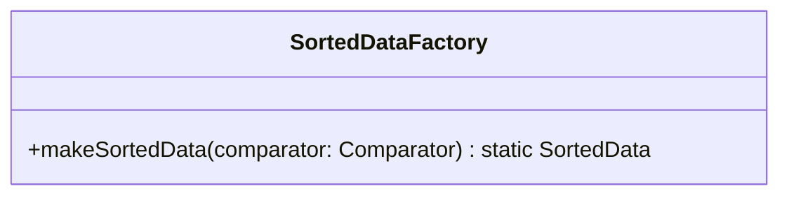

# SortedDataFactory.java

## Explanation

This file defines the SortedDataFactory class in the sorteddata package. It belongs to src/sorteddata in the COMP2100 MiniLab codebase and contains implementation logic for its codebase module. Key methods include makeSortedData.

## Complexity

Complexity depends on the methods used in this class. Review loops, collection operations, and persistence calls for exact bounds.

## UML



## Code
```java
package sorteddata;

import java.util.Comparator;

/**
 * As of week 4, we now have an additional implementation of the Sorted Data interface,
 * namely AVLTree. By replacing just this one line of code below, we are able to change
 * the type of sorted data used across all the modelled DAO classes.
 */
public class SortedDataFactory {
	public static <T> SortedData<T> makeSortedData(Comparator<T> comparator) {
		return new sorteddata.avltree.AVLTree<>(comparator);
	}
}

```
