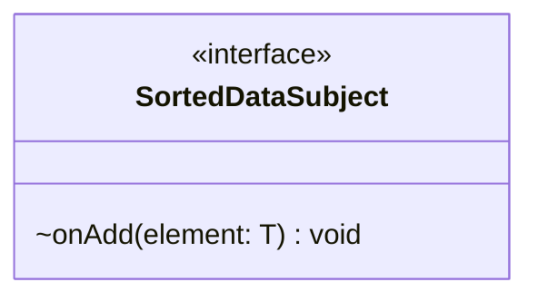

# SortedDataSubject.java

## Explanation

This file defines the SortedDataSubject interface in the sorteddata package. It belongs to src/sorteddata in the COMP2100 MiniLab codebase and defines a contract that other classes implement. Key methods include onAdd.

## Complexity

Complexity depends on the methods used in this class. Review loops, collection operations, and persistence calls for exact bounds.

## UML



## Code
```java
package sorteddata;

public interface SortedDataSubject<T> {
	void onAdd(T element);
}

```
