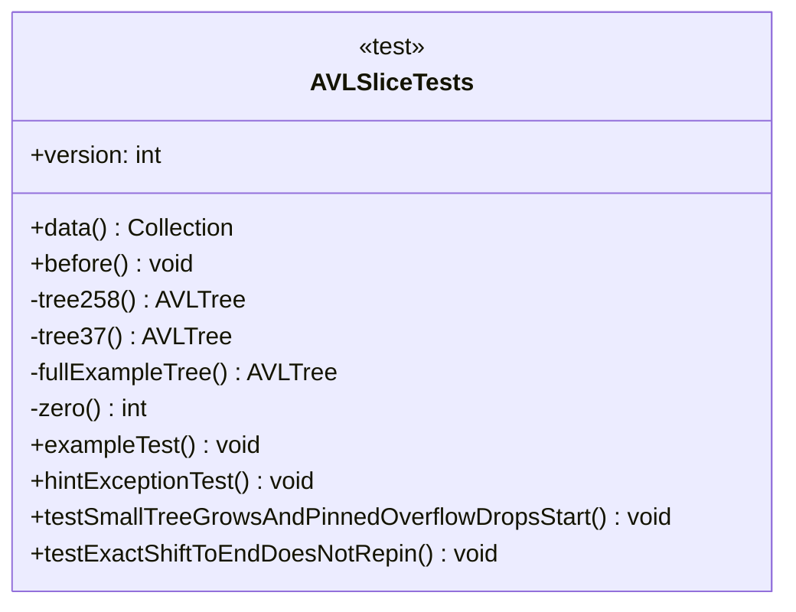

# AVLSliceTests.java

## Explanation

This test file defines the AVLSliceTests class. It belongs to test in the COMP2100 MiniLab codebase and verifies behavior of the avl slice implementation. It uses JUnit 4 style testing through org.junit imports. Key methods include data, before, tree258, tree37, fullExampleTree.

## Complexity

Test complexity depends on the tested scenario and input size; most unit tests use small fixed-size inputs.

## UML



## Code
```java
import sorteddata.avltree.AVLTestBuilder;
import sorteddata.avltree.AVLTree;
import sorteddata.avltree.AVLTreeSlice;
import org.junit.Before;
import org.junit.BeforeClass;
import org.junit.Test;
import org.junit.runner.RunWith;
import org.junit.runners.Parameterized;

import java.util.*;

import static junit.framework.TestCase.assertEquals;

@RunWith(Parameterized.class)
public class AVLSliceTests {
	/*
	This code uses JUnit's parameterised unit testing to run your bank of test
	cases against eleven different implementations. On your local machine, none
	of your test cases will pass (since) the AVLTreeSlice implementation provided
	is just dummy code, regardless of the version number. However, on the CI,
	your test cases will be run properly, and once this task is complete, only
	one of the versions should pass.

	If you refer to the test cases from last week, they also used parameterised unit
	testing to simplify a long bank of similar test cases and reduce code duplication.
	Parameterised unit testing has a number of purposes.

	Please do not edit this template code, or the CI will have unpredictable results.
	 */
	@Parameterized.Parameters(name = "Version {0}")
	public static Collection<Object[]> data() {
		return Arrays.asList(new Object[][] {
				{0}, {1}, {2}, {3}, {4}, {5}, {6}, {7}, {8}, {9}, {10}
		});
	}

	@Parameterized.Parameter
	public int version;
	@Before
	public void before() {
		AVLTreeSlice.setVersion(version);
	}

	// Please do not edit the code above this line.

	// TODO: Write your test cases below this line.
	private AVLTree<Integer> tree258() {
		AVLTestBuilder<Integer> builder = new AVLTestBuilder<>(Comparator.<Integer>naturalOrder());
		builder.setTreeRoot(builder.make(5, builder.make(2), builder.make(8)));
		return builder.getTree();
	}

	private AVLTree<Integer> tree37() {
		AVLTestBuilder<Integer> builder = new AVLTestBuilder<>(Comparator.<Integer>naturalOrder());
		builder.setTreeRoot(builder.make(7, builder.make(3), builder.empty()));
		return builder.getTree();
	}

	private AVLTree<Integer> fullExampleTree() {
		AVLTestBuilder<Integer> builder = new AVLTestBuilder<>(Comparator.<Integer>naturalOrder());
		builder.setTreeRoot(
				builder.make(7,
						builder.make(3, builder.make(1), builder.make(4)),
						builder.make(13, builder.make(10), builder.empty()))
		);
		return builder.getTree();
	}

	private int zero() {
		return version - version;
	}

	/**
	 * This is an example test case to give you some inspiration.
	 * You may complete this test case according to the given TODO,
	 * or delete it -- the choice is yours.
	 */
	@Test(timeout=100)
	public void exampleTest() {
		AVLTree<Integer> tree = tree258();
		AVLTreeSlice<Integer> slice = tree.slice(4);

		assertEquals(Arrays.asList(2, 5, 8), slice.getResult());
	}

	/**
	 * As a hint, don't forget about this syntax. This test case will pass
	 * if and only if the code inside raises an ArithmeticException at some
	 * point. If no exception is raised, the test case fails.
	 */
	@Test(timeout=100, expected = ArithmeticException.class)
	public void hintExceptionTest() {
		assertEquals(1, 5 / zero());
	}

	@Test(timeout=100)
	public void testSmallTreeGrowsAndPinnedOverflowDropsStart() {
		AVLTree<Integer> tree = tree37();
		AVLTreeSlice<Integer> slice = tree.slice(4);

		assertEquals(Arrays.asList(3, 7), slice.getResult());

		tree.insert(5);
		assertEquals(Arrays.asList(3, 5, 7), slice.getResult());

		tree.insert(9);
		assertEquals(Arrays.asList(3, 5, 7, 9), slice.getResult());

		tree.insert(11);
		assertEquals(Arrays.asList(5, 7, 9, 11), slice.getResult());
	}

	@Test(timeout=100)
	public void testExactShiftToEndDoesNotRepin() {
		AVLTree<Integer> tree = fullExampleTree();
		AVLTreeSlice<Integer> slice = tree.slice(4);

		assertEquals(Arrays.asList(4, 7, 10, 13), slice.getResult());

		assertEquals(2, slice.shiftBackward(2));
		assertEquals(Arrays.asList(1, 3, 4, 7), slice.getResult());

		assertEquals(2, slice.shiftForward(2));
		assertEquals(Arrays.asList(4, 7, 10, 13), slice.getResult());

		tree.insert(9);
		assertEquals(Arrays.asList(4, 7, 9, 10), slice.getResult());
	}

	@Test(timeout=100)
	public void testOvershiftToEndRepins() {
		AVLTree<Integer> tree = fullExampleTree();
		AVLTreeSlice<Integer> slice = tree.slice(4);

		assertEquals(Arrays.asList(4, 7, 10, 13), slice.getResult());

		assertEquals(2, slice.shiftBackward(2));
		assertEquals(Arrays.asList(1, 3, 4, 7), slice.getResult());

		assertEquals(2, slice.shiftForward(100));
		assertEquals(Arrays.asList(4, 7, 10, 13), slice.getResult());

		tree.insert(9);
		assertEquals(Arrays.asList(7, 9, 10, 13), slice.getResult());
	}

	@Test(timeout=100)
	public void testPinnedInsertMatchesSpecificationExample() {
		AVLTree<Integer> tree = tree37();
		AVLTreeSlice<Integer> slice = tree.slice(4);

		tree.insert(1);
		tree.insert(4);
		tree.insert(10);
		assertEquals(Arrays.asList(3, 4, 7, 10), slice.getResult());

		tree.insert(9);
		assertEquals(Arrays.asList(4, 7, 9, 10), slice.getResult());
	}

	@Test(timeout=100)
	public void testUnpinnedInsertMatchesSpecificationExample() {
		AVLTree<Integer> tree = fullExampleTree();
		AVLTreeSlice<Integer> slice = tree.slice(4);

		assertEquals(Arrays.asList(4, 7, 10, 13), slice.getResult());

		assertEquals(1, slice.shiftBackward(1));
		assertEquals(Arrays.asList(3, 4, 7, 10), slice.getResult());

		tree.insert(9);
		assertEquals(Arrays.asList(3, 4, 7, 9), slice.getResult());
	}

	@Test(timeout=100)
	public void testPinnedAndUnpinnedBoundarySequence() {
		AVLTree<Integer> tree = fullExampleTree();
		AVLTreeSlice<Integer> slice = tree.slice(4);

		assertEquals(Arrays.asList(4, 7, 10, 13), slice.getResult());

		tree.insert(0);
		assertEquals(Arrays.asList(4, 7, 10, 13), slice.getResult());

		tree.insert(15);
		assertEquals(Arrays.asList(7, 10, 13, 15), slice.getResult());

		assertEquals(2, slice.shiftBackward(2));
		assertEquals(Arrays.asList(3, 4, 7, 10), slice.getResult());

		tree.insert(5);
		assertEquals(Arrays.asList(3, 4, 5, 7), slice.getResult());

		tree.insert(12);
		assertEquals(Arrays.asList(3, 4, 5, 7), slice.getResult());

		assertEquals(1, slice.shiftForward(1));
		assertEquals(Arrays.asList(4, 5, 7, 10), slice.getResult());

		tree.insert(6);
		assertEquals(Arrays.asList(4, 5, 6, 7), slice.getResult());
	}

	@Test(timeout=100)
	public void testImpossibleForwardFromPinnedEndKeepsPinned() {
		AVLTree<Integer> tree = fullExampleTree();
		AVLTreeSlice<Integer> slice = tree.slice(4);

		assertEquals(Arrays.asList(4, 7, 10, 13), slice.getResult());
		assertEquals(0, slice.shiftForward(1));
		assertEquals(Arrays.asList(4, 7, 10, 13), slice.getResult());

		tree.insert(9);
		assertEquals(Arrays.asList(7, 9, 10, 13), slice.getResult());
	}

	@Test(timeout=100)
	public void testPinnedInsertIntoMiddleKeepsEnd() {
		AVLTree<Integer> tree = fullExampleTree();
		AVLTreeSlice<Integer> slice = tree.slice(4);

		assertEquals(Arrays.asList(4, 7, 10, 13), slice.getResult());

		tree.insert(5);
		assertEquals(Arrays.asList(5, 7, 10, 13), slice.getResult());
	}
}

```
