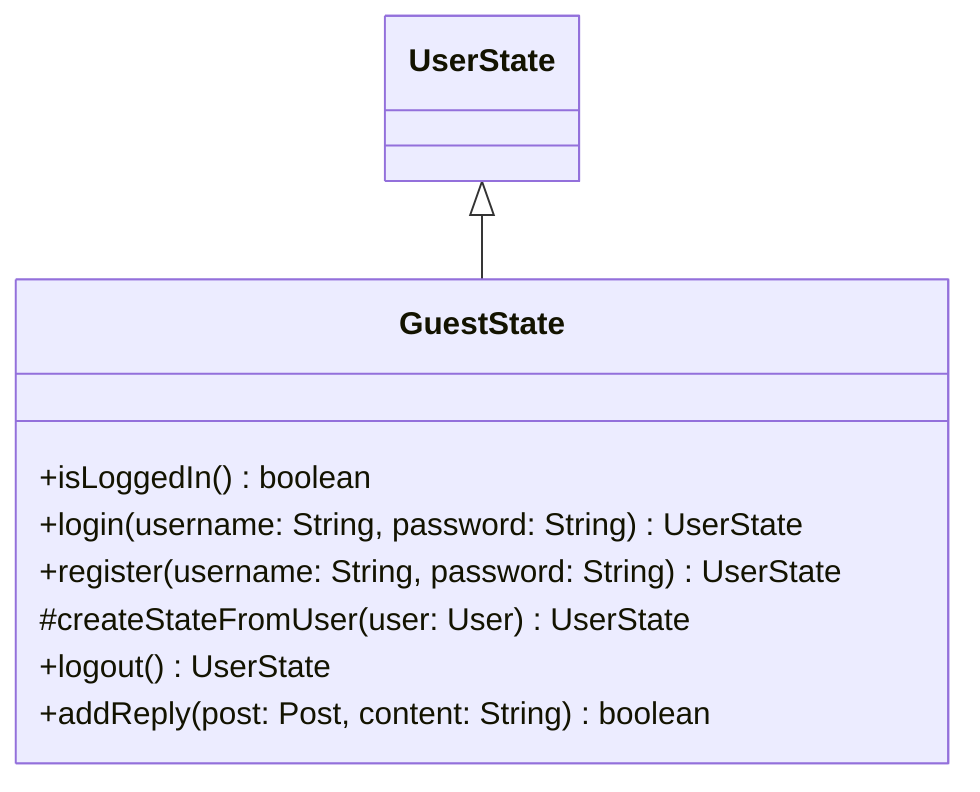

# GuestState.java

## Explanation

This file defines the GuestState class in the userstate package. It belongs to src/userstate in the COMP2100 MiniLab codebase and models user state and state-transition behavior. Key methods include isLoggedIn, login, register, createStateFromUser, logout.

## Complexity

State transition operations are typically O(1) unless they trigger persistence or collection traversal.

## UML



## Code
```java
package userstate;

import dao.UserDAO;
import dao.model.Post;
import dao.model.User;

public class GuestState extends UserState {
	@Override
	public boolean isLoggedIn() {
		return false;
	}

	@Override
	public UserState login(String username, String password) {
		User user = UserDAO.getInstance().login(username, password);
		return createStateFromUser(user);
	}

	@Override
	public UserState register(String username, String password) {
		User user = UserDAO.getInstance().register(username, password);
		return createStateFromUser(user);
	}

	protected UserState createStateFromUser(User user) {
		if (user == null) return this;
		if (user.role() == User.Role.Admin) return new AdminState(user);
		return new MemberState(user);
	}

	@Override
	public UserState logout() {
		return this;
	}

	@Override
	public boolean addReply(Post post, String content) {
		return false;
	}
}

```
