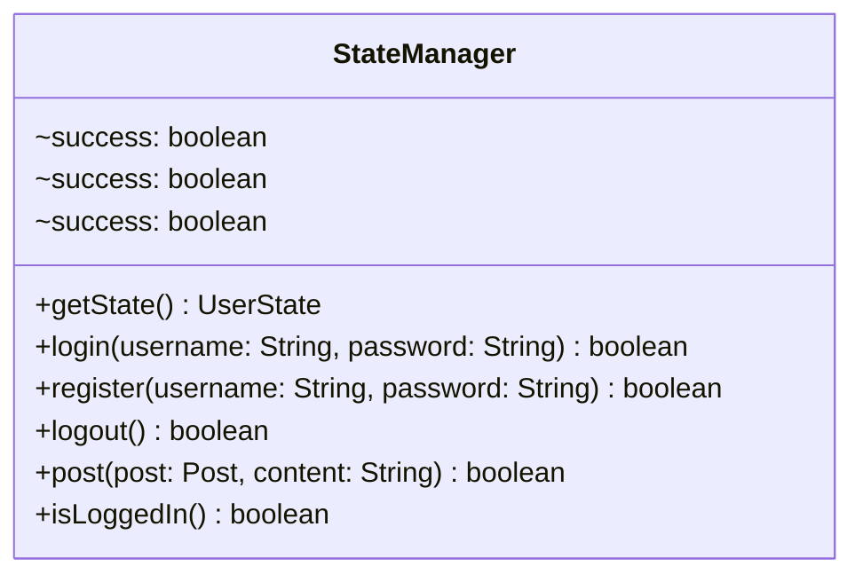

# StateManager.java

## Explanation

This file defines the StateManager class in the userstate package. It belongs to src/userstate in the COMP2100 MiniLab codebase and models user state and state-transition behavior. Key methods include getState, login, register, logout, post.

## Complexity

State transition operations are typically O(1) unless they trigger persistence or collection traversal.

## UML



## Code
```java
package userstate;

import dao.model.Post;

public class StateManager {
	private static UserState state = new GuestState();

	public static UserState getState() {
		return state;
	}

	public static boolean login(String username, String password) {
		// TODO: Complete this method in accordance with the State design pattern
		// For this task, you may modify the other classes and interfaces within
		//  the userstate package by adding methods, including public ones
		UserState newState = state.login(username, password);
		boolean success = newState != state;
		state = newState;
		return success;
	}

	public static boolean register(String username, String password) {
		UserState newState = state.register(username, password);
		boolean success = newState != state;
		state = newState;
		return success;
	}

	public static boolean logout() {
		UserState newState = state.logout();
		boolean success = newState != state;
		state = newState;
		return success;
	}

	public static boolean post(Post post, String content) {
		return state.addReply(post, content);
	}

	public static boolean isLoggedIn() {
		return state.isLoggedIn();
	}
}

```
