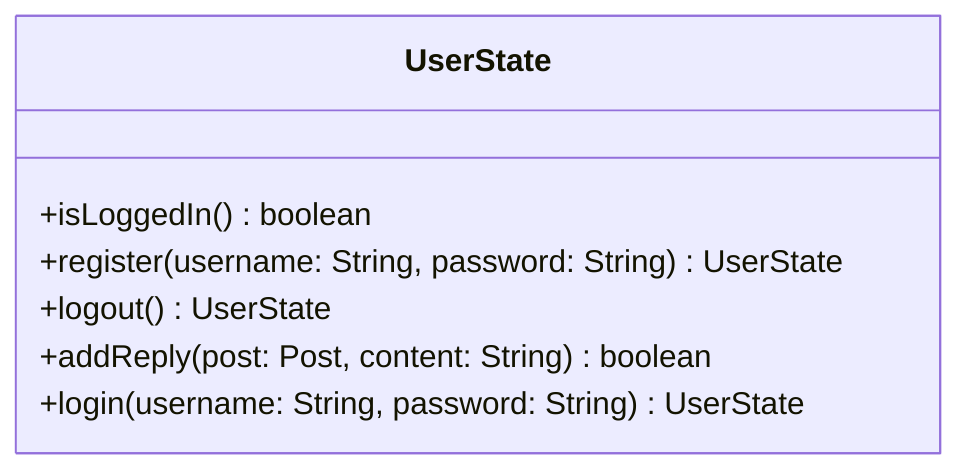

# UserState.java

## Explanation

This file defines the UserState class in the userstate package. It belongs to src/userstate in the COMP2100 MiniLab codebase and models user state and state-transition behavior. Key methods include isLoggedIn, register, logout, addReply, login.

## Complexity

State transition operations are typically O(1) unless they trigger persistence or collection traversal.

## UML



## Code
```java
package userstate;

import dao.model.Post;

public abstract class UserState {
	public abstract boolean isLoggedIn();

	public abstract UserState register(String username, String password);

	public abstract UserState logout();

	public abstract boolean addReply(Post post, String content);

	public abstract UserState login(String username, String password);
}

```
